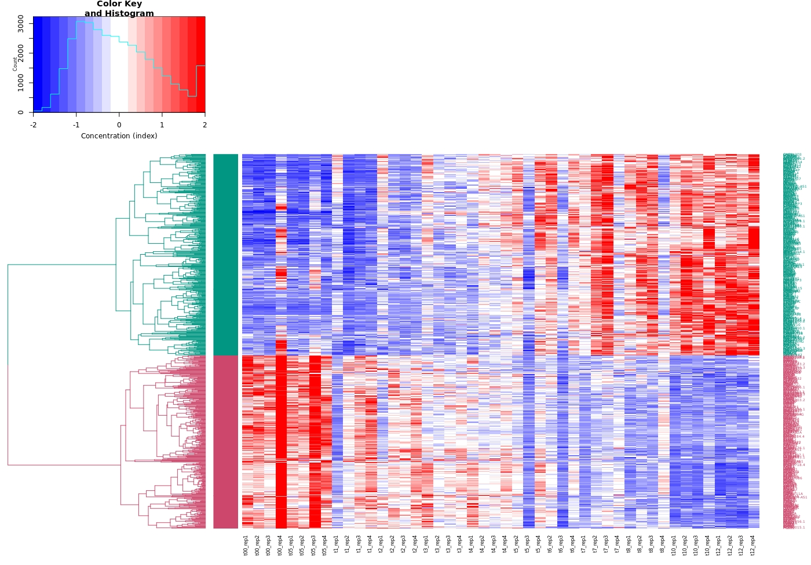
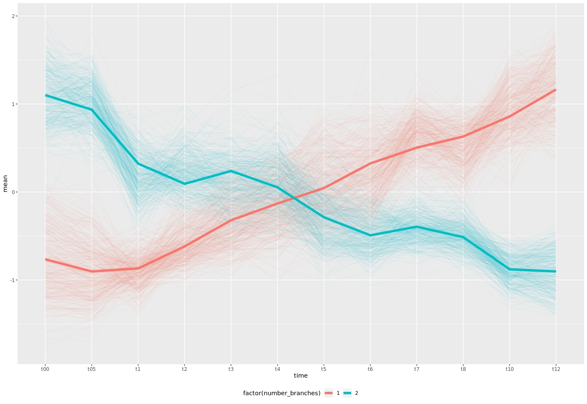
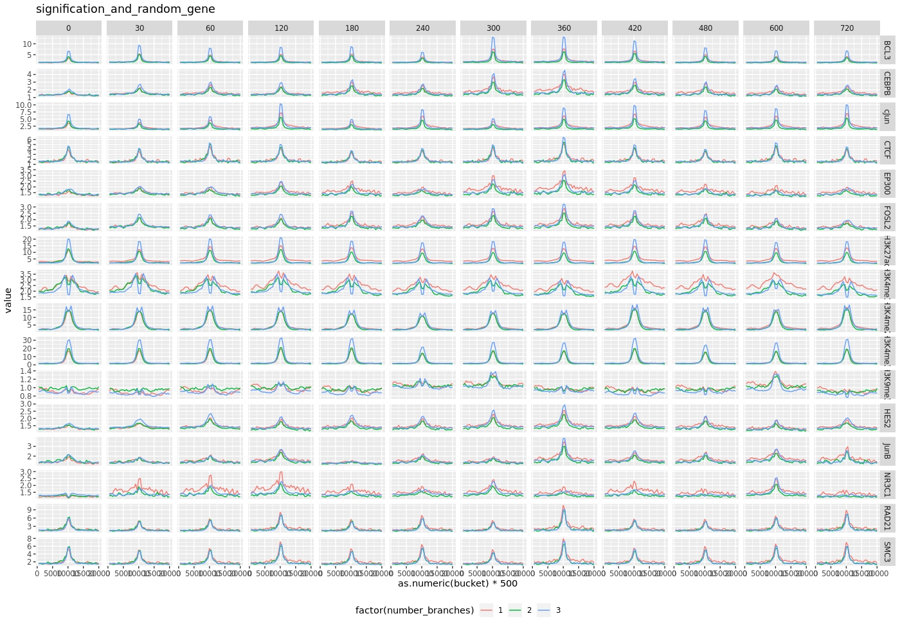

# ifpan-chipseq-timecourse
###### Mateusz Zięba
---

Dane do RNA-seq dla dexamethazonu (12 plików) pobrano z [https://www.ncbi.nlm.nih.gov/gds/?term=tim+reddy+dexamethasone+rna-seq](https://www.ncbi.nlm.nih.gov/gds/?term=tim+reddy+dexamethasone+rna-seq) na podstawie plików przygotowano plik raw_macierz.txt i sample.info.txt
Z esembla ściągnięto plik zwierający: 
-Gene stable ID
-Gene stable ID version
-Gene name
plik z nazwy mart.export.txt zmieniono na ID_ID.version_gene.txtx

Z esembla ściągnięto plik zawierający:
- Gene.stable.ID
- Chromosome.scaffold.name
- Gene.start..bp.
- Gene.end..bp.
- Gene.name
- Strand

Zmieniono nazwę pliku z mart.export.txt na gene_chromosome_start_end_strand.txt
Uruchomić skrypt z R: skript_R_clean.R (od 1-123 lini) skrypt wczytuje  pliki raw_macierz.txt (zapisuje do raw.data),  sample.info.txt(zapisuje do samples) i ID_ID.version_gene.txt (zapisuje do ID_ID.version_gene). Wykonuje anove na raw.data, i przy FDR_THRESHOLD=0.001, zostaje wybranych 737 genów (dla dwóch nie została przypisana nazwa, została odrzucone i zostało 735).  Skrypt tworzy heatmap dla RNA-seq dla wybranych transkryptów (z dwoma klastrami), 

oraz wykres liniowy pokazujący jak zmienia się zawartość transkryptów dla obu klastrów w czasie.


Chip-seq
Dane dla Chip-seq ściągnięto z:
[https://www.ncbi.nlm.nih.gov/gds/?term=tim+reddy+dexamethasone+chip-seq+nr3c1](https://www.ncbi.nlm.nih.gov/gds/?term=tim+reddy+dexamethasone+chip-seq+nr3c1), dane dla poszczególnych plików znajdują się w pliku: chipseq-file-info.txt (przygotowano go przy pomocy pliku gds.results.txt ściągniętego z powyższej strony i komendy: 
```console
cat gds_result.txt |  sed -e 's/ /\t/g' | grep -P -B 1 -A 6 "ChIP-seq\ton" | grep -oP 'GSE[0-9]*|[0-9\.]*.hours|supplied\).*ChIP-seq' | xargs -n5 -d'\n' | sed 's/(GR)\t//' | awk '{print $2 "\t" $4*60 "\t""ftp://ftp.ncbi.nlm.nih.gov/geo/series/"$6"nnn/"$7"/suppl/"$7"_RAW.tar""\t"$7}' ) > chipseq-file-info.txt
```
i pobrano pliki z pliku.

Z esembla ściągnąć plik zawierający 
- Gene.stable.ID
- Gene.stable.ID.version
- Transcript.length
- gene.name

Nazwę pliku zmienić na transcript_length.txt
Uruchomić fragment skryptu  skript_R_clean.R (od 126-139), skrypt wczytuje plik gene_chromosome_start_end_strand.txt, i tworzy plik signification_gene.txt
W skrypcie bigwig_genomic_range_extract_normalize_totsv.sh, do GENES_INFO_FILE_NAME przypisać plik signification_gene.txt, wynik działania skryptu zapisać big.table.normalize.tsv. Następnie w skrypcie bucket.sh, do do FILE_INPUT przypisać big.table.normalize.txt, a do FILE_OUTPUT bigtablebucket_normalize.tsv. 
Skrypty do normalizacji ściągnięto z: 
[https://github.com/porchard/normalize_bedgraph](https://github.com/porchard/normalize_bedgraph)
oraz skrypty: bigWigToBedGraph, bedGraphToBigWig.
Uruchomić skrypt z R (linie 141-173) w którym zostaje obliczone RPKM (średnia ilość transkryptu) dla signification_gene.txt zgodnie ze wzorem znajdującym sie na stronie: [https://www.biostars.org/p/273537/](https://www.biostars.org/p/273537/), oraz wygenerowany zostaje wykres w skali logarytmiczej,  ukazujący średnią długość transkryptów.


Następnie urochomienie kodu od 176-196 skript_R_clean.R w którym zostaje obliczone RPKM dla wszystkich transkryptów, oraz zostaje wylosowana próba losowa 1000 genów (których RPKM znajduję sie pomiędzy 2 a 8192 - ponieważ w takiej wiekości mieściły się transkrypty dla signification_gene, odczytano z wykresu)

Uruchomienie skript_R_clean.R  (linie 199 -209) przygotuje stworzy plik random_gene.txt zawierający:
- numer chromosomu
- miejsce 10000 przed miejscem startu transkrypcji
- miejsce 10000 po miejscu startu transkrypcji
- nazwę genu

W skrypcie bigwig_genomic_range_extract_normalize_totsv.sh do GENES_INFO_FILE_NAME przypisać plik random_gene.txt, wynik działania skryptu zapisać do random_gene_normalize.txt.  
Następnie w skrypcie bucket.sh, do do FILE_INPUT przypisać random_gene_normalize.txt, a do FILE_OUTPUT random_gene_normalize_bucket.tsv. 
Uruchomić skript_R_clean.R (linie 211-253) skrypt wczytuje random_gene_normalize_bucket.tsv, tworzy tabelę dla znaczących i losowych genów i toworzy wykres.




