# ifpan-chipseq-timecourse
###### Mateusz Zięba
---
### RNA-seq

Dane do RNA-seq dla dexamethazonu (12 plików) pobrano z [https://www.ncbi.nlm.nih.gov/gds/?term=tim+reddy+dexamethasone+rna-seq](https://www.ncbi.nlm.nih.gov/gds/?term=tim+reddy+dexamethasone+rna-seq) na podstawie plików przygotowano plik raw_macierz.txt i sample.info.txt
Z esembla ściągnięto plik zwierający: 
-Gene stable ID
-Gene stable ID version
-Gene name
plik z nazwy mart.export.txt zmieniono na ID_ID.version_gene.txtx

Z esembla ściągnięto plik zawierający:
- Gene.stable.ID
- Chromosome.scaffold.name
- Gene.start..bp.
- Gene.end..bp.
- Gene.name
- Strand

Zmieniono nazwę pliku z mart.export.txt na gene_chromosome_start_end_strand.txt
Uruchomić skrypt z R: skript_R_clean.R (od 1-123 lini) skrypt wczytuje  pliki raw_macierz.txt (zapisuje do raw.data),  sample.info.txt(zapisuje do samples) i ID_ID.version_gene.txt (zapisuje do ID_ID.version_gene). Wykonuje anove na raw.data, i przy FDR_THRESHOLD=0.001, zostaje wybranych 737 genów (dla dwóch nie została przypisana nazwa, została odrzucone i zostało 735).  Skrypt tworzy heatmap dla RNA-seq dla wybranych transkryptów (z dwoma klastrami), 

oraz wykres liniowy pokazujący jak zmienia się zawartość transkryptów dla obu klastrów w czasie.


### Chip-seq

Dane dla Chip-seq ściągnięto z:
[https://www.ncbi.nlm.nih.gov/gds/?term=tim+reddy+dexamethasone+chip-seq+nr3c1](https://www.ncbi.nlm.nih.gov/gds/?term=tim+reddy+dexamethasone+chip-seq+nr3c1), dane dla poszczególnych plików znajdują się w pliku: chipseq-file-info.txt (przygotowano go przy pomocy pliku gds.results.txt ściągniętego z powyższej strony i komendy: 
```console
cat gds_result.txt |  sed -e 's/ /\t/g' | grep -P -B 1 -A 6 "ChIP-seq\ton" | grep -oP 'GSE[0-9]*|[0-9\.]*.hours|supplied\).*ChIP-seq' | xargs -n5 -d'\n' | sed 's/(GR)\t//' | awk '{print $2 "\t" $4*60 "\t""ftp://ftp.ncbi.nlm.nih.gov/geo/series/"$6"nnn/"$7"/suppl/"$7"_RAW.tar""\t"$7}' ) > chipseq-file-info.txt
```
i pobrano pliki z pliku.

Z esembla ściągnąć plik zawierający 
- Gene.stable.ID
- Gene.stable.ID.version
- Transcript.length
- gene.name

Nazwę pliku zmienić na transcript_length.txt
Uruchomić fragment skryptu  skript_R_clean.R (od 126-139), skrypt wczytuje plik gene_chromosome_start_end_strand.txt, i tworzy plik signification_gene.txt
W skrypcie bigwig_genomic_range_extract_normalize_totsv.sh, do GENES_INFO_FILE_NAME przypisać plik signification_gene.txt, wynik działania skryptu zapisać big.table.normalize.tsv. Następnie w skrypcie bucket.sh, do do FILE_INPUT przypisać big.table.normalize.txt, a do FILE_OUTPUT bigtablebucket_normalize.tsv. 
Skrypty do normalizacji ściągnięto z: 
[https://github.com/porchard/normalize_bedgraph](https://github.com/porchard/normalize_bedgraph)
oraz skrypty: bigWigToBedGraph, bedGraphToBigWig.
Uruchomić skrypt z R (linie 141-173) w którym zostaje obliczone RPKM (średnia ilość transkryptu) dla signification_gene.txt zgodnie ze wzorem znajdującym sie na stronie: [https://www.biostars.org/p/273537/](https://www.biostars.org/p/273537/), oraz wygenerowany zostaje wykres w skali logarytmiczej,  ukazujący średnią długość transkryptów.


Następnie urochomienie kodu od 176-196 skript_R_clean.R w którym zostaje obliczone RPKM dla wszystkich transkryptów, oraz zostaje wylosowana próba losowa 1000 genów (których RPKM znajduję sie pomiędzy 2 a 8192 - ponieważ w takiej wiekości mieściły się transkrypty dla signification_gene, odczytano z wykresu)

Uruchomienie skript_R_clean.R  (linie 199 -209) przygotuje stworzy plik random_gene.txt zawierający:
- numer chromosomu
- miejsce 10000 przed miejscem startu transkrypcji
- miejsce 10000 po miejscu startu transkrypcji
- nazwę genu

W skrypcie bigwig_genomic_range_extract_normalize_totsv.sh do GENES_INFO_FILE_NAME przypisać plik random_gene.txt, wynik działania skryptu zapisać do random_gene_normalize.txt.  
Następnie w skrypcie bucket.sh, do do FILE_INPUT przypisać random_gene_normalize.txt, a do FILE_OUTPUT random_gene_normalize_bucket.tsv. 
Uruchomić skript_R_clean.R (linie 211-253) skrypt wczytuje random_gene_normalize_bucket.tsv, tworzy tabelę dla znaczących i losowych genów i toworzy wykres.


### Peak dla enhancerów
Wycięto peaki dla enhancerów dla genów upregulowanych, dla NR3C1 z pierwszej godziny przy pomocy polecenia:
```console
bedtools intersect -a GSM2421929_ENCFF835HHK_peaks_GRCh38.bed.gz -b up_regulated_gene.BED -wb | cut -f1,2,3,14 | awk '{print $1"\t"$2-1000"\t"$3+1000"\t"$4}'  > upregulatedgne_peaks_NR3C1_time60_file1.tsv
```
dla trzech plików:
```console
grep 'NR3C1.60.f' chipseq-file-info.txt | sort -k2 -n | awk '{print $4"_RAW.tar"}' | xargs -i bash -c "tar -tf {} | grep bed.gz" |  xargs -i bash -c 'bedtools intersect -a {} -b up_regulated_gene.BED'
```
Następnie uruchomić skrypt:
```console
./peak_NR3C1_normalize.sh > peaks_NR3C1_normalize_file1_time60.tsv
```
Wybieranie randomowych peaków (154) przy pomocy:
```console
zcat GSM2421929_ENCFF835HHK_peaks_GRCh38.bed.gz | shuf -n 154 | cut -f1,2,3 | awk '{print $1"\t"$2-1000"\t"$3+1000"\tRANDOM"}' > random_peaks_NR3C1_time60_file1.tsv

```

Uruchomić skrypt wyciągający peaki dla randomowych:
```console
./peak_NR3C1_normalize.sh > random_peaks_NR3C1_time60_file1_normalize.tsv 
```
Pliki: 
- peaks_NR3C1_normalize_file1_time60.tsv
- random_peaks_NR3C1_time60_file1_normalize.tsv  
wczytano do R i zrobiono wykresy: 

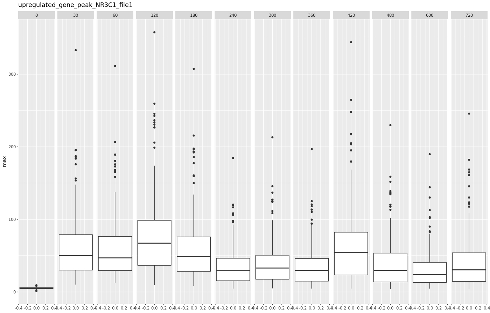

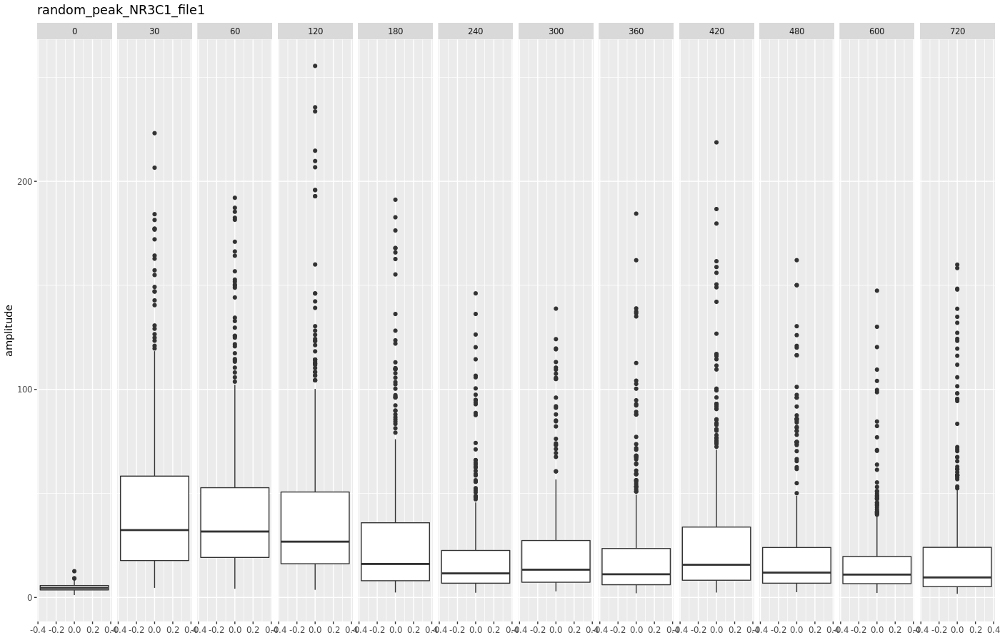

zapisanie peaków wspólnych, z trzech plików dla NR3C1 po jednej godzinie 

```console
bedtools intersect -a up_regulated_gene.BED -b GSM2421929_ENCFF835HHK_peaks_GRCh38.bed.gz GSM2421930_ENCFF044MLR_peaks_GRCh38.bed.gz GSM2421931_ENCFF597LEE_peaks_GRCh38.bed.gz -u > upregulated_gene_allfiles_peaks_NR3C1.tsv

```
wyciągnięcie peaków, i przygotowanie do puszczenia w skrypcie
```console
bedtools intersect -a upregulated_gene_allfiles_peaks_NR3C1.tsv -b GSM2421929_ENCFF835HHK_peaks_GRCh38.bed.gz -wb | awk '{print $1"\t"$6-1000"\t"$7+1000"\t"$4}' > upregulatedgene_peak_NR3C1_time60_allfile_intoskript.tsv
```


Uruchomienie skryptu:

```console
./peak_NR3C1_normalize.sh > upregulated_peaks_NR3C1_allfile_time60_allTF.tsv

```
grep 'NR3C1.60.f' chipseq-file-info.txt | awk '{print $4"_RAW.tar"}' | xargs -i bash -c "tar -tf {} | grep bed.gz" | echo $(cat) | xargs -i bash -c 'bedtools intersect -a down_regulated_gene.BED -b {} -wb -wa' | head

tworzenie pliku części wspólnej plików: 
- GSM2421929_ENCFF835HHK_peaks_GRCh38.bed.gz 
- GSM2421930_ENCFF044MLR_peaks_GRCh38.bed.gz 
- GSM2421931_ENCFF597LEE_peaks_GRCh38.bed.gz
oraz wyciągnięcie i zapisanie peaków down i up regulowanych

```console
bedtools intersect -a  GSM2421929_ENCFF835HHK_peaks_GRCh38.bed.gz -b GSM2421930_ENCFF044MLR_peaks_GRCh38.bed.gz > tmp_peak_file1-2.tsv
bedtools intersect -a GSM2421931_ENCFF597LEE_peaks_GRCh38.bed.gz -b tmp_peak_file1-2.tsv > peaks_allfile_NR3C1_time60.bed
bedtools intersect -a up_regulated_gene.BED -b peaks_allfile_NR3C1_time60.bed -wb | awk '{print $1"\t"$6-1000"\t"$7+1000"\t"$4}' > upregulated_peak_NR3C1_time60_allfile.tsv
down_regulated_gene.BED -b peaks_allfile_NR3C1_time60.bed -wb | awk '{print $1"\t"$6-1000"\t"$7+1000"\t"$4}' > downregulated_peak_NR3C1_time60_allfile.tsv

```
puszczenie skryptu
```console
./peak_NR3C1_normalize.sh > upregulated_peaks_NR3C1_allfile_time60_allTF_normalize.tsv
```
sprawdzić i poprawić co nie potrzebne

komenda wyciągająca największą wartość z wiersza, test
```bash
for((i=1;i<=100;i+=1)); do cat upregulated_peaks_NR3C1_allfile_time60_allTF_normalize.tsv | cut -f8-3000 | head -100 | head -n$i | tail -1 | sed 's/\t/\n/g' | sort -n | tail -1; done 
```
komenda łącząca dwa wyniki
```bash
awk 'FNR==NR { a[FNR""] = $0; next } { print a[FNR""]"\t" $0 }' <(cat upregulated_peaks_NR3C1_allfile_time60_allTF_normalize.tsv | cut -f1-7 | head -10) <(for((i=1;i<=10;i+=1)); do cat upregulated_peaks_NR3C1_allfile_time60_allTF_normalize.tsv | cut -f8-3000 | head -100 | head -n$i | tail -1 | sed 's/\t/\n/g' | sort | tail -1; done) 
```
```bash
for((i=1;i<=$(awk 'END {print NR}' important_gene.txt); i+=1));do echo $i;done
cat upregulated_peaks_NR3C1_allfile_time60_allTF_normalize.tsv | head -1 | cut -f1-$(cat upregulated_peaks_NR3C1_allfile_time60_allTF_normalize.tsv | awk '{print NF}' | sort -n | tail -1)
```

```bash
awk 'FNR==NR { a[FNR""] = $0; next } { print a[FNR""]"\t" $0 }' <(cat upregulated_peaks_NR3C1_allfile_time60_allTF_normalize.tsv | cut -f1-7) <(for((i=1;i<=395968;i+=1)); do cat upregulated_peaks_NR3C1_allfile_time60_allTF_normalize.tsv | cut -f8-3560 | head -n$i | tail -1 | sed 's/\t/\n/g' | sort -n | tail -1; done) > upregulated_peaks_NR3C1_allTF_amplitude_time60.tsv
```
Wykres boxplot dla peaków upregulowanych NR3C1 time60(BED): 

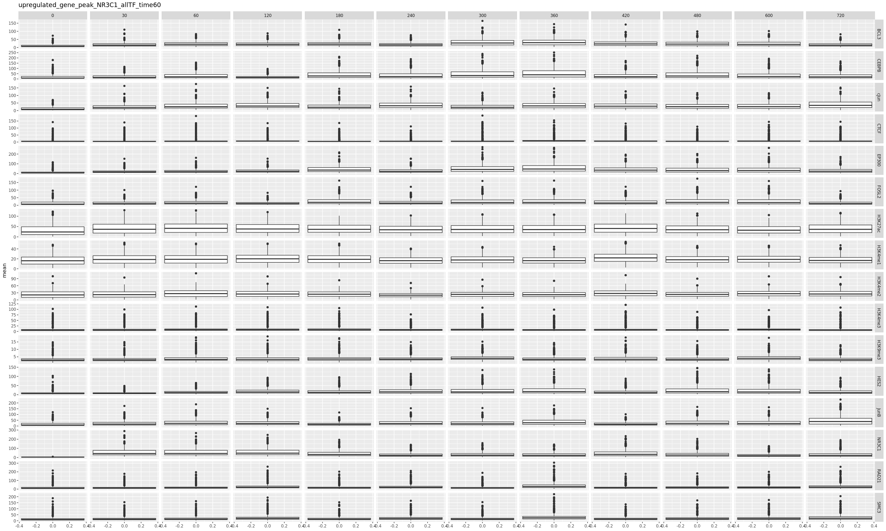


Wyciągnięcie 1000 randomowych peaków
```bash
cat peaks_allfile_NR3C1_time60.bed | shuf -n 1000 | cut -f1,2,3 | awk '{print $1"\t"$2-1000"\t"$3+1000"\tRANDOM"}' > random1000_peak.tsv
```
uruchomienie skryptu
```bash
./peak_amplitude_NR3C1_normalize.sh random1000_peak.tsv > random1000_peaks_NR3C1_allTF_amplitude_time60.tsv
```

przygotowanie peaków dla randomowych genów
```bash
bedtools intersect -a random_gene_into_peak.tsv -b peaks_allfile_NR3C1_time60.bed -wb | awk '{print $1"\t"$6-1000"\t"$7+1000"\t"$4}' > random_gen_peak_NR3C1_time60_allfile.tsv
```

uruchomienie skryptu wyciągającego amplitudę dla peaku
```bash
```


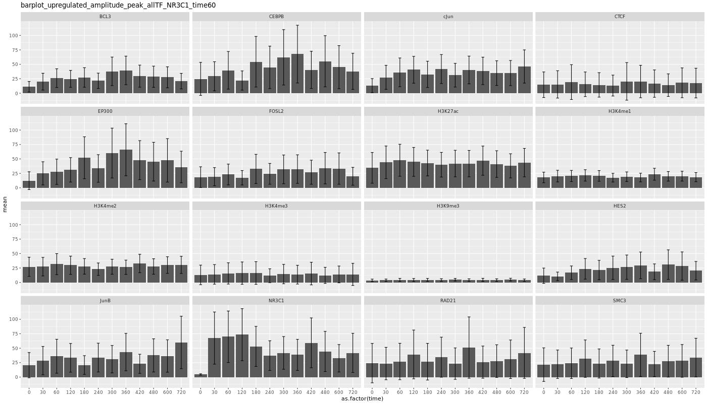
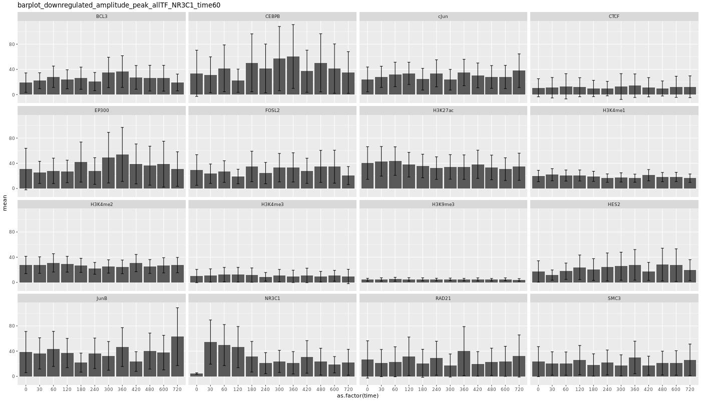
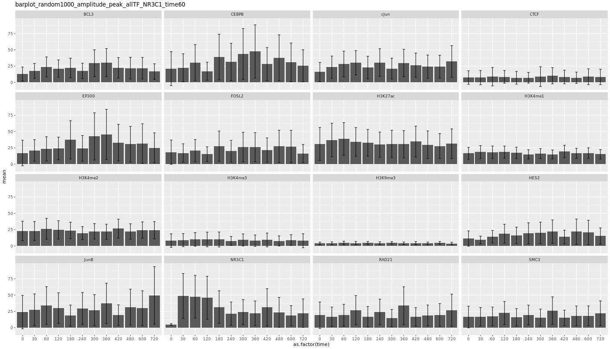


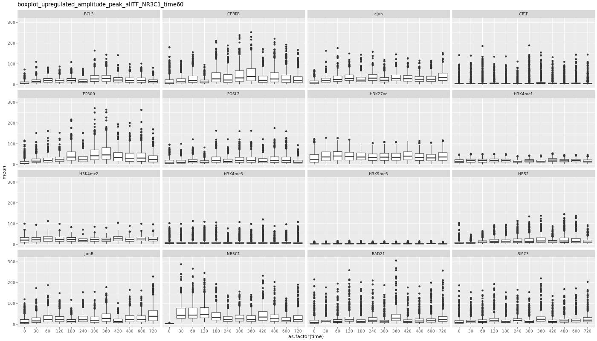
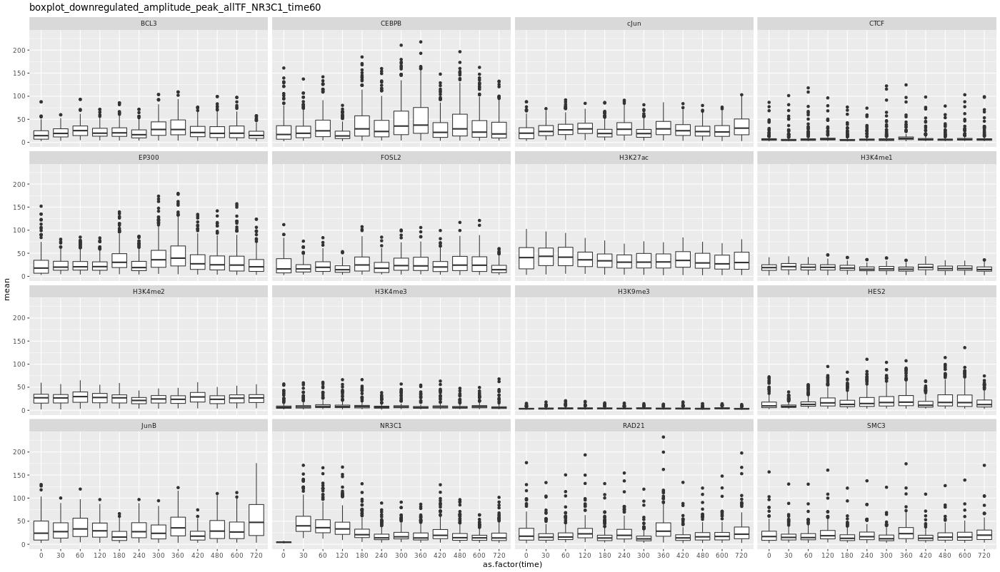
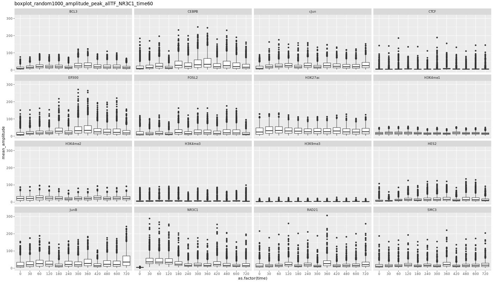
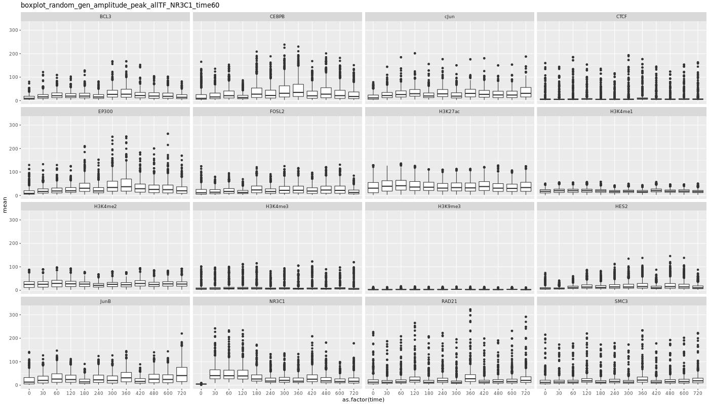

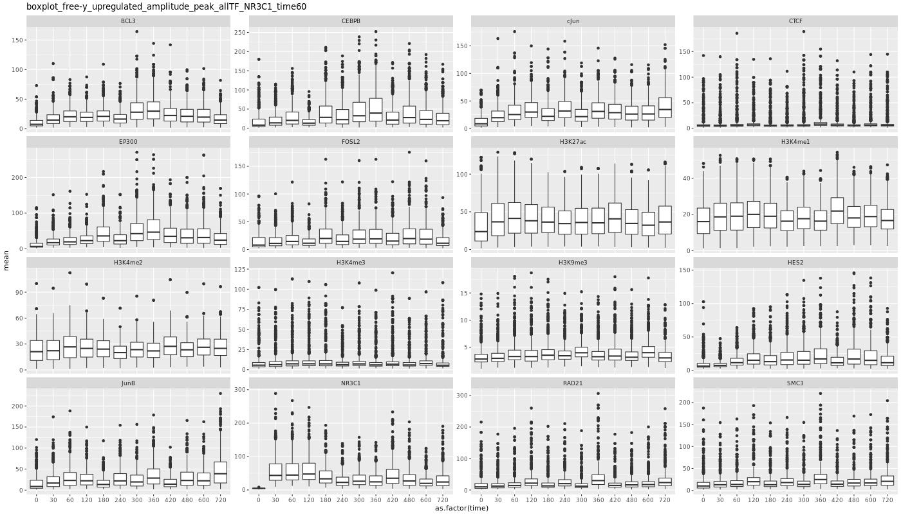
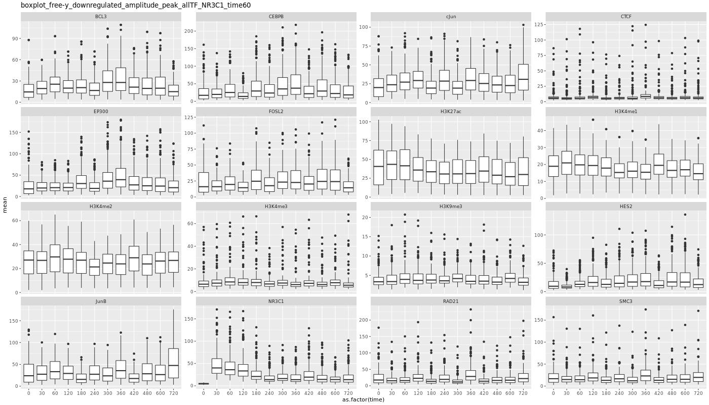
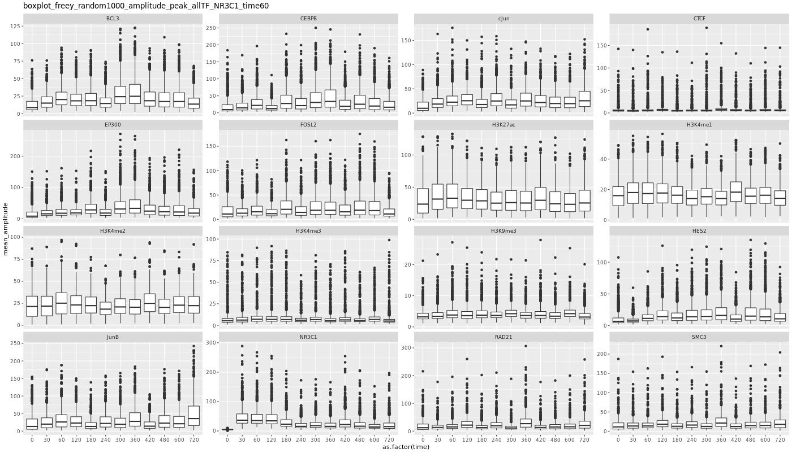

