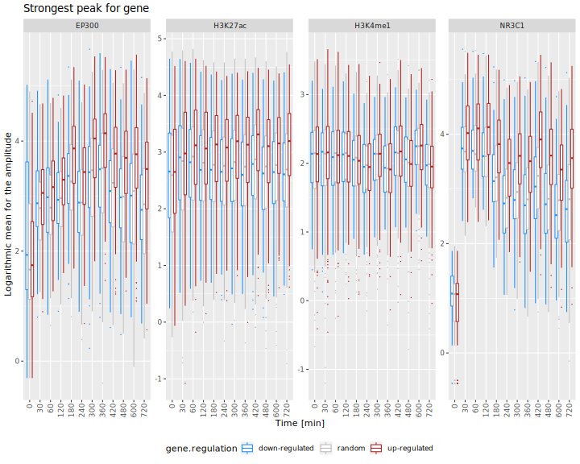
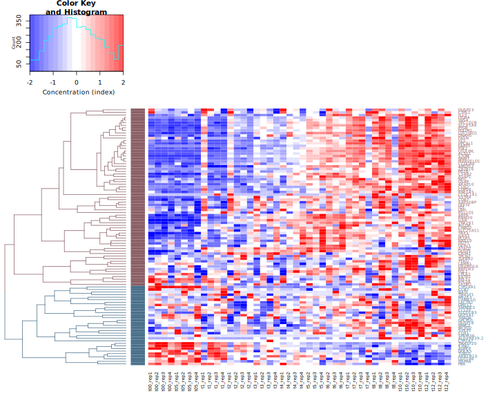
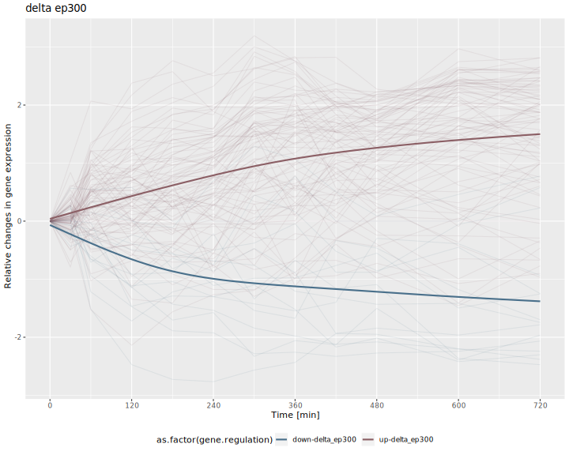

# ifpan-chipseq-timecourse
###### Mateusz Zieba
---

  

### RNA-seq

RNA-seq data from the ENCODE project were downloaded with [this link](https://www.ncbi.nlm.nih.gov/gds/?term=tim+reddy+dexamethasone+rna-seq) saved as `info-RNA-seq-to-download.txt` in `DATA`. See [this file](DATA/downloads.MD) for details on how the data was downloaded.

[analysis_transcriptome.R](https://github.com/ippas/ifpan-chipseq-timecourse/blob/master/SCRIPTS/analysis_transcriptome.R) contains RNAseq analysis code:

1. Downloaded data are loaded (including data downloaded from genebank)
2. Raw read counts are normalised (normalize quantiles)
3. Differentially Expressed Genes (DEGs) are selected based on one-way ANOVA (n = 745 genes with FDR < 0.0000001 treshold)
4. DEGs are divided into two clusters - upregulated (n = 370) and downregulated (n = 375)
5. A list of random genes with similar expression levels is chosen (n = 745)
6. Following graphs are prepared: line graph, heatmap, boxplot of weighted timepoint of max change, RPKM histogram (calculated according to [this info](https://www.biostars.org/p/273537/), transcript length histogram (accordint to: [transcript.length.tsv](https://github.com/ippas/ifpan-chipseq-timecourse/blob/master/DATA/transcript_length.tsv)
7. Additional tables for further analyses are prepared: [promotores_peaks_info.tsv]()https://github.com/ippas/ifpan-chipseq-timecourse/blob/master/DATA/promotores_peaks_info.tsv and [enhancer_info.tsv](https://github.com/ippas/ifpan-chipseq-timecourse/blob/master/DATA/enhancer_info.tsv) do znalezienia enhancerów - these ables contain information about gene identifiers, location and cluster.


### ChIP-seq

Chip-seq data were dowloaded from [this link](https://www.ncbi.nlm.nih.gov/gds/?term=tim+reddy+dexamethasone+chip-seq+nr3c1),
The [gds_result.txt](https://github.com/ippas/ifpan-chipseq-timecourse/blob/master/DATA/info-chip-seq-to-download.txt) was downloaded and translated into a file that contained:
- TF name
- time of cell fixation
- ftp adress for data dowload

With this command:

```bash
cat ~/ifpan-chipseq-timecourse/DATA/info-chip-seq-to-download.txt | 
   sed -e 's/ /\t/g' | 
   grep -P -B 1 -A 6 "ChIP-seq\ton" | 
   grep -oP 'GSE[0-9]*|[0-9\.]*.hours | supplied\).*ChIP-seq' | 
   xargs -n5 -d'\n' | 
   sed 's/(GR)\t//' | 
   awk '{print $2 "\t" $4*60 "\t""ftp://ftp.ncbi.nlm.nih.gov/geo/series/"$6"nnn/"$7"/suppl/"$7"_RAW.tar""\t"$7}' > ~/ifpan-chipseq-timecourse/DATA/chipseq-file-info.tsv
```
files were downloaded with this command:

```bash
cat ~/ifpan-chipseq-timecourse/DATA/chipseq-file-info.tsv | 
   cut -f3 | 
   xargs -i bash -c 'wget {} -P ~/ChIP-seq/DOWNLOAD'
```

2. Chipseq data were extracted with [this script](https://github.com/ippas/ifpan-chipseq-timecourse/blob/master/SCRIPTS/extract_data_chipseq1.sh), which:

-
Skrypt wykonuje:
 - przy pomocy [promotores_peaks_info.tsv](https://github.com/ippas/ifpan-chipseq-timecourse/blob/master/DATA/promotores_peaks_info.tsv) i [bigwig_genomic_bucket500_extract_normalize_to_tsv.sh [1]](#1) wyciąga informacje dotyczące przyłączania się TF do DNA w zakresie +/-10000 od TSS i zapisuje do ~/ChIP-seq/DATApromotores_peaks_value.tsv
 - z trzech próbek tworzy część wspólną peaków w genomie dla NR3C1 dla time = 60
 - przy pomocy wyznaczonej części wspólnej peaków, wyciąga enhancery znajdujące się w zakresach znajdujących się w [enhancer_info.tsv](https://github.com/ippas/ifpan-chipseq-timecourse/blob/master/DATA/enhancer_info.tsv) (+/-100000 od TSS)
 - dla wybranych enhancerów korzystając z [bigwig_genomic_amplitude_extract_normalize_to_tsv.sh [2]](#2) wyciąga maksymalną wartość przyłączania się TF do peaku i zapisuje dane do: ~/ChIP-seq/DATA/enhancer_amplitude_value.tsv 
 - dla wybranych enhancerów korzystając z [bigwig_genomic_range_extract_normalize_to_tsv.sh [3]](#3) wyciąga wartości przyłączeń się TF na całym zakresie peaku i zapisuje dane do: ~/ChIP-seq/DATA/enhancer_peaks_value.tsv

3. Uruchomić skrypt [visualization_promoters.R](https://github.com/ippas/ifpan-chipseq-timecourse/blob/master/SCRIPTS/visualization_promoters.R), który wykonuje wykresy:
- wczytuje plik ~/ChIP-seq/DATA/promotores_peaks_value.tsv, który jest wynikiem skryptu [extract_data_chipseq1.sh](https://github.com/ippas/ifpan-chipseq-timecourse/blob/master/SCRIPTS/extract_data_chipseq1.sh)
- wykres liniowy predstawiający średnią z grupy przyłączenia się TF (wybrane cztery TF: EP300, H3K27ac, H3K4me1, NR3C1) do promotorów w pozycjach =/- 10000 od TSS,
- wykres liniowy predstawiający średnią z grupy przyłączenia się TF (wybrane cztery TF: EP300, H3K27ac, H3K4me1, NR3C1) do promotorów w pozycjach =/- 10000 od TSS, w odniesieniu do genów z grupy random


4. Uruchomić skrypt [visualization_amplitudes.R](https://github.com/ippas/ifpan-chipseq-timecourse/blob/master/SCRIPTS/visualization_amplitudes.R), który:
- wczytuje plik ~/ChIP-seq/DATA/enhancer_amplitude_value.tsv, będący wynikiem skryptu [extract_data_chipseq1.sh](https://github.com/ippas/ifpan-chipseq-timecourse/blob/master/SCRIPTS/extract_data_chipseq1.sh)
- usuwa peaki które nachodzą na zakres +/- 2000 od TSS
- wybiera najsilniejszy peak z pośród zbioru peaków przypisanych do jednego genu. Wybranie najsilniejszych odbywa się poprzes obliczenie średniej amplitudy z 12 punktów czasowych we wszystkich próbkach, i najsilniejszy peak to ten który posiada najwyższą średnią
- w przypadku gdy jeden peak został przypisany do kilku genów, to wybierany jest ten gen który znajduje się najbliżej TSS, pozostałe peaki zostają usunięte
- tworzy wykres zmian amplitud z przłączania TF (NR3C1, EP300, H3K27ac, H3K4me1) w przygotowancyh peakach, zpodziałem na up-regulated i down-regulated 
- oblicza mean weighted time (MWT) przyłączania TF (NR3C1, EP300, H3K27ac, H3K4me1) do enhancerów w genach uprulowanych
- oblicza max change time point (MCTP) dla expressji genów upregulowanych dla których zostały wybrane enhancery
- tworzy boxplot na którym zostaje przedstawiony mean weighted time przyłączania TF oraz max change time point ekspressji genów upregulowanych 
- na danych z MWT i MCTP wykonuje dwucznnikową anowę z błędem +Error(gene.nama) oraz pairwise.t.test i wykonuje poprawkę borferroniego w prach gdzie występojue NR3C1 i ekspresja
-
- dla wybranych peaków przygotowuje plik [enhancer_bigrange_info.tsv](https://github.com/ippas/ifpan-chipseq-timecourse/blob/master/DATA/enhancer_bigrange_info.tsv) z zakresem +/- 10000 pozycji nukleotydów od wyliczonej średniej pozycji amplitudy w peaku na podstawie wszystkich timepointów z wyłączenie time = 0





 
Uruchomić [extract_data_chipseq2.sh](https://github.com/ippas/ifpan-chipseq-timecourse/blob/master/SCRIPTS/extract_data_chipseq2.sh) komendą:

```bash
 ~/ifpan-chipseq-timecourse/SCRIPTS/./extract_data_chipseq2.sh
 ```
- skrypt korzysta z [bigwig_genomic_range_extract_normalize_to_tsv_bucket10.sh [4]](#4) i pliku [enhancer_bigrange_info.tsv](https://github.com/ippas/ifpan-chipseq-timecourse/blob/master/DATA/enhancer_bigrange_info.tsv), zostają wyciągnięte dane dla enhancerów w zakresie +/-10000 od środka peaku i zapisane do pliku ~/ChIP-seq/DATA/enhancer_bigrange_value.tsv


Przy pomocy komendy ściągnięto plik gtf:

```bash
wget  ftp://ftp.ebi.ac.uk/pub/databases/gencode/Gencode_human/release_36/gencode.v36.annotation.gtf.gz
```
Następnie wybrano geny kodujące białka i zapisuje do [Homo_sapiens.GRCh38.95.protein_coding.gtf](https://github.com/ippas/ifpan-chipseq-timecourse/blob/master/DATA/Homo_sapiens.GRCh38.95.protein_coding.gtf):
```bash
zcat ~/ChIP-seq/DATA/gencode.v36.annotation.gtf | 
    grep "gene_type \"protein_coding\"" | 
    awk '{print $10"\t"$16}' | 
    sort -u | 
    grep -v "[1-3];" | 
    sed 's/"//g' | 
    sed 's/;//g' | 
    sed 's/\./\t/' | 
    cut -f1,3 > ~/ifpan-chipseq-timecourse/DATA/Homo_sapiens.GRCh38.95.protein_coding.gtf
```


Uruchomić [visualization_enhancer_range.R](https://github.com/ippas/ifpan-chipseq-timecourse/blob/master/SCRIPTS/visualization_enhancer_range.R)
- wczytuje plik ~/ChIP-seq/DATA/enhancer_bigrange_value.tsv, będący wynikiem skryptu [extract_data_chipseq2.sh](https://github.com/ippas/ifpan-chipseq-timecourse/blob/master/SCRIPTS/extract_data_chipseq2.sh)
- wykres liniowy predstawiający średnią z grupy przyłączenia się TF (wybrane cztery TF: EP300, H3K27ac, H3K4me1, NR3C1) do enhancerów w pozycjach =/- 2000 od wyznaczonego środka peaku,
- wykres liniowy predstawiający średnią z grupy przyłączenia się TF (wybrane cztery TF: EP300, H3K27ac, H3K4me1, NR3C1) do enhancerów w pozycjach =/- 2000 od wyznaczonego środka peaku, w odniesieniu do peaków z grupy random
- wczytuje [Homo_sapiens.GRCh38.95.protein_coding.gtf](https://github.com/ippas/ifpan-chipseq-timecourse/blob/master/DATA/Homo_sapiens.GRCh38.95.protein_coding.gtf) zawierający nazwy genów kodujących białka i ich numery ensemblid 
- przygotowuje plik [range_all_genes.bed](https://github.com/ippas/ifpan-chipseq-timecourse/blob/master/DATA/range_all_genes.bed) z zakresem +/- 100000 pozycji nukleotydów od TSS genów kodujących białka, plik jest potrzebny do znalezienia peaków nachodzących w tym zakresie


Uruchomić skrypt [extract_data_chipseq3.sh](https://github.com/ippas/ifpan-chipseq-timecourse/blob/master/SCRIPTS/extract_data_chipseq3.sh) komendą:

```bash
 ~/ifpan-chipseq-timecourse/SCRIPTS/./extract_data_chipseq3.sh
 ```
 - korzystając z bedtools intersect i trzech próbek tworzy część wspólną peaków w genomie dla NR3C1 dla time = 60
 - przy pomocy wyznaczonej części wspólnej próbek, wyciąga enhancery znajdujące się w zakresach znajdujących się w [range_all_genes.bed](https://github.com/ippas/ifpan-chipseq-timecourse/blob/master/DATA/range_all_genes.bed) (+/-100000 od TSS)
 - dla wybranych enhancerów korzystając z [bigwig_genomic_amplitude_extract_normalize_to_tsv.NR3C1-EP300.sh [5]](#5) wyciąga maksymalną wartość przyłączania się TF (NR3C1 i EP300) do peaku i zapisuje dane do: ~/ChIP-seq/DATA/enhancer_amplitude_value.tsv 


### Analiza EP300 


#### Delta EP300
Uruchomić skrypt [delta_ep300.R](https://github.com/ippas/ifpan-chipseq-timecourse/blob/master/SCRIPTS/delta_ep300.R), którego kod wykonuje:
- wczytuje ~/ChIP-seq/DATA/peaks_all_genes_ep300_nr3c1_amplitude.tsv będący wynikiem [extract_data_chipseq3.sh](https://github.com/ippas/ifpan-chipseq-timecourse/blob/master/SCRIPTS/extract_data_chipseq3.sh) i usuwa peaki które nachodzą na zakres +/- 2000 od TSS
- oblicza różnicę pomiędzy maksymalną wartością amplitudy a miniwalną wartością amplitudy dla EP300
- sortuje obliczoną różnicę od największej do najmniejszej, 
- w przypadku gdy zostało przypisane kilka genów do jednego peaku, to wybiera ten gen którego TSS jest najbliżej peaku
- w przypakdu gdy do jednego genu zostało przypisane kilka peaków, to wybiera ten peak który znajduje się bliżej TSS
- wybiera 100 peaków z wcześniej obliczoną różnicą
- wykonuje heatmape ekspressji dla wybranych 100 genów
- dokonuje podziału na dwa klastry down-delta_ep300 i up-delta_ep300
- tworzy wykres zmian amplitud z przłączania TF (NR3C1, EP300) w przygotowancyh peakach, zpodziałem na up-delta_ep300 i down-delta_ep300
- oblicza mean weighted time (MWT) przyłączania TF (NR3C1, EP300, H3K27ac, H3K4me1) do enhancerów w genach up-delta_ep300
- oblicza max change time point (MCTP) dla expressji genów up-delta_ep300 dla których zostały wybrane enhancery
- tworzy boxplot na którym zostaje przedstawiony mean weighted time przyłączania TF oraz max change time point ekspressji genów up-delta_ep300
- tworzy [enhancer_delta_ep300_info.tsv](https://github.com/ippas/ifpan-chipseq-timecourse/blob/master/DATA/enhancer_delta_ep300_info.tsv), który zawiera informacje do wyciągnięcia dancyh o przyłączaniu TF do całego zakresu peaku






Uruchomić skrypt [extract_data_chipseq1_ep300.sh](https://github.com/ippas/ifpan-chipseq-timecourse/blob/master/SCRIPTS/extract_data_chipseq1_ep300.sh), który:
- korzystając z [enhancer_delta_ep300_info.tsv](https://github.com/ippas/ifpan-chipseq-timecourse/blob/master/DATA/enhancer_delta_ep300_info.tsv) i [bigwig_genomic_range_extract_normalize_to_tsv.sh [3]](#3) wyciąga wartości przyłączeń się TF na całym zakresie peaku i zapisuje dane do: ~/ChIP-seq/DATA/enhancer_peaks_delta_ep300.tsv


Uruchomić [centering_peaks_ep300.sh](https://github.com/ippas/ifpan-chipseq-timecourse/blob/master/SCRIPTS/centering_peaks_ep300.R), który:
- wczytyje plik stworzony przez [extract_data_chipseq1_ep300.sh](https://github.com/ippas/ifpan-chipseq-timecourse/blob/master/SCRIPTS/extract_data_chipseq1_ep300.sh)
- określa środek peaku poprzez obliczenie średniej z amplitud dla NR3C1 z wszystkich czasów i próbek z wyłączeniem timepoint = 0
- wyznacza przedział +/- 10000 od środka peaku i potrzebne informacje zapisuje do [enhancer_bigrange_delta_ep300_info.tsv](https://github.com/ippas/ifpan-chipseq-timecourse/blob/master/DATA/enhancer_bigrange_delta_ep300_info.tsv)


Uruchomić skrypt [extract_data_chipseq2_ep300.sh](https://github.com/ippas/ifpan-chipseq-timecourse/blob/master/SCRIPTS/extract_data_chipseq2_ep300.sh), który:
- korzystając z [bigwig_genomic_range_extract_normalize_to_tsv_bucket10.sh [4]](#4) i pliku [enhancer_bigrange_delta_ep300_info.tsv](https://github.com/ippas/ifpan-chipseq-timecourse/blob/master/DATA/enhancer_bigrange_delta_ep300_info.tsv) wyciąga dane z przyłączania TF w enhancerach, a wynik zapisuje do pliku ~/ChIP-seq/DATA/enhancer_bigrange_delta_ep300.tsv


Uruchomić skrypt [analysis_enhancer_range_ep300.R](https://github.com/ippas/ifpan-chipseq-timecourse/blob/master/SCRIPTS/analysis_enhancer_range_ep300.R), który wykonuje:
- wczytuje dane peków delta ep300 ~/ChIP-seq/DATA/enhancer_bigrange_delta_ep300.tsv, który zawiera wartości przyłączeń TF +/- 10000 od pozycji amplitudy dla peaków NR3C1
-wykonuje uśredniony wykres liniowy zmian przyłączania TF w zakresie +/- 2000 od pozycji wyznaczonego środka peaków względem NR3C1 dla czterech TF EP300, H3K27ac, H3K4me1, NR3C1, dla genów delta ep300
- tworzy heatmape zmian przyłączania TF w zakresie +/- 2000 od pozycji amplitudy peaków dla NR3C1, dla dancyh delta ep300


Do wyciągania danych dla Chip-seq z plików bigWig przygotowano skrypty:
- <a id="1">[1]</a> [bigwig_genomic_bucket500_extract_normalize_to_tsv.sh](https://github.com/ippas/ifpan-chipseq-timecourse/blob/master/SCRIPTS/bigwig_genomic_bucket500_extract_normalize_to_tsv.sh)
    - wyciąga dane z plików bigwig o zakresie 20001, wynik zbiera po 500 pozycji i liczy średnią w celu zmniejszenia ilości danych i wyeliminowania szumów, w przypadku ostaniego baketowania liczy średnią z 501 pozycji
    - wyciąganie zakresów przy pomocy [bigWigToBedGraph](https://github.com/ippas/ifpan-chipseq-timecourse/blob/master/SCRIPTS/bigWigToBedGraph) [pobrane z](http://hgdownload.soe.ucsc.edu/admin/exe/linux.x86_64.v369/)
    - wyciąga dane dla wszystkich czynników transkrypcyjnych znajdujących się w pliku [chipseq-file-info.tsv](https://github.com/ippas/ifpan-chipseq-timecourse/blob/master/DATA/chipseq-file-info.tsv)
- <a id="2">[2]</a> [bigwig_genomic_amplitude_extract_normalize_to_tsv.sh](https://github.com/ippas/ifpan-chipseq-timecourse/blob/master/SCRIPTS/bigwig_genomic_amplitude_extract_normalize_to_tsv.sh)
    - wyciąga amplitudy z podanych zakresów w plikach bigwig
    - wyciąga amplitudy przy pomocy [bigWigSummary](https://github.com/ippas/ifpan-chipseq-timecourse/blob/master/SCRIPTS/bigWigSummary) [pobrane z](http://hgdownload.soe.ucsc.edu/admin/exe/linux.x86_64.v369/)
    - wyciąga dane dla wszystkich czynników transkrypcyjnych znajdujących się w pliku [chipseq-file-info.tsv](https://github.com/ippas/ifpan-chipseq-timecourse/blob/master/DATA/chipseq-file-info.tsv)
- <a id="3">[3]</a> [bigwig_genomic_range_extract_normalize_to_tsv.sh](https://github.com/ippas/ifpan-chipseq-timecourse/blob/master/SCRIPTS/bigwig_genomic_range_extract_normalize_to_tsv.sh)
    - wyciąga cały podany zakres z plików bigwig
    - wyciąganie zakresów przy pomocy [bigWigToBedGraph](https://github.com/ippas/ifpan-chipseq-timecourse/blob/master/SCRIPTS/bigWigToBedGraph) [pobrane z](http://hgdownload.soe.ucsc.edu/admin/exe/linux.x86_64.v369/)
    - wyciąga dane dla czterech czynników transkrypcyjnych: EP300, H3K27ac, H3K4me1, NR3C1
- <a id="4">[4]</a> [bigwig_genomic_range_extract_normalize_to_tsv_bucket10.sh](https://github.com/ippas/ifpan-chipseq-timecourse/blob/master/SCRIPTS/bigwig_genomic_range_extract_normalize_to_tsv_bucket10.sh)
    - wyciąga dane z plików bigwig o zakresie 20001, wynik zbiera po 10 i liczy średnią w celu zmniejszenia ilości danych i wyeliminowania szumów, w przypadku ostatniego baketowania liczy średnią z 11 pozycji
    - wyciąganie zakresów przy pomocy [bigWigToBedGraph](https://github.com/ippas/ifpan-chipseq-timecourse/blob/master/SCRIPTS/bigWigToBedGraph) [pobrane z](http://hgdownload.soe.ucsc.edu/admin/exe/linux.x86_64.v369/)
    - - wyciąga dane dla czterech czynników transkrypcyjnych: EP300, H3K27ac, H3K4me1, NR3C1
- <a id="5">[5]</a> [bigwig_genomic_amplitude_extract_normalize_to_tsv.NR3C1-EP300.sh](https://github.com/ippas/ifpan-chipseq-timecourse/blob/master/SCRIPTS/bigwig_genomic_amplitude_extract_normalize_to_tsv.NR3C1-EP300.sh)
    - wyciąga amplitudy z podanych zakresów w plikach bigwig
    - wyciąga amplitudy przy pomocy [bigWigSummary](https://github.com/ippas/ifpan-chipseq-timecourse/blob/master/SCRIPTS/bigWigSummary) [pobrane z](http://hgdownload.soe.ucsc.edu/admin/exe/linux.x86_64.v369/)
    - wyciąga dane dla dwóch czynników transkrypcyjnych: NR3C1 i EP300
- wszystkie powyższe skrypty wykonują normalizację danych korzystając ze skryptów:
    - [bigWigToBedGraph](https://github.com/ippas/ifpan-chipseq-timecourse/blob/master/SCRIPTS/bigWigToBedGraph) [pobrane z](http://hgdownload.soe.ucsc.edu/admin/exe/linux.x86_64.v369/)
    - [normalize_bedgraph.py](https://github.com/ippas/ifpan-chipseq-timecourse/blob/master/SCRIPTS/normalize_bedgraph.py) [pobrane z](https://github.com/porchard/normalize_bedgraph)
    - [bedGraphToBigWig](https://github.com/ippas/ifpan-chipseq-timecourse/blob/master/SCRIPTS/bedGraphToBigWig) [pobrane z](http://hgdownload.soe.ucsc.edu/admin/exe/linux.x86_64.v369/)

-----------------------------------------------Starsza wersja--------------------------------------------------------

Uruchomić skrypt z R: RNA-seq.R (od 1-141 lini) skrypt wczytuje  pliki raw_expression_matrix_dexamethasone.tsv,  sample.info.tsv i ID_ID.version_gene.tsv. Wykonuje jednoczynnikową ANOVE dla każdego transkryptu, i przy FDR_THRESHOLD=0.001, zostaje wybranych 640 genów (dla dwóch nie została przypisana nazwa, została odrzucone i zostało 638).  Skrypt tworzy heatmap dla RNA-seq dla wybranych transkryptów (z dwoma klastrami), 


oraz wykres liniowy pokazujący jak zmienia się zawartość transkryptów dla obu klastrów w czasie.


Z esembla ściągnięto plik zawierający:
- Gene.stable.ID
- Chromosome.scaffold.name 
- Gene.start..bp.
- Gene.end..bp.
- Gene.name
- Strand

Uruchomienie RNA-seq.R (od 162-212) wczyta plik ~/ifpan-chipseq-timecourse/DATA/gene_chromosome_start_end_strand.tsv i wygeneruje histogram ze środnią ilością transkryptu dal genów down-regulated i up-regulated. RPKM został obliczony przy pomocy wzoru podanego na stronie: [https://www.biostars.org/p/273537/](https://www.biostars.org/p/273537/)


### Chip-seq

Dane dla Chip-seq ściągnięto z:
[https://www.ncbi.nlm.nih.gov/gds/?term=tim+reddy+dexamethasone+chip-seq+nr3c1](https://www.ncbi.nlm.nih.gov/gds/?term=tim+reddy+dexamethasone+chip-seq+nr3c1),
Pobrano plik tekstowy gds_result.txt którego nazwę zmieniono na info-chip-seq-to-download.txt i zapisano w ~/ifpan-chipseq-timecourse/DATA/, przypomocy tego pliku przygotowano plik zawierający nazwę czynnika transkrypcyjnego, czas w którym nastąpiło utrwalenie komórek, adress ftp do strony z której trzeba pobrać plik z danymi. Plik wykonano przy użyciu komendy:

```bash
cat ~/ifpan-chipseq-timecourse/DATA/info-chip-seq-to-download.txt | 
   sed -e 's/ /\t/g' | 
   grep -P -B 1 -A 6 "ChIP-seq\ton" | 
   grep -oP 'GSE[0-9]*|[0-9\.]*.hours | supplied\).*ChIP-seq' | 
   xargs -n5 -d'\n' | 
   sed 's/(GR)\t//' | 
   awk '{print $2 "\t" $4*60 "\t""ftp://ftp.ncbi.nlm.nih.gov/geo/series/"$6"nnn/"$7"/suppl/"$7"_RAW.tar""\t"$7}' > ~/ifpan-chipseq-timecourse/DATA/chipseq-file-info.tsv
```

Przy pomocy pliku chipseq-file-info.tsv pobrano pliki przy użyciu komendy: 

```bash
cat ~/ifpan-chipseq-timecourse/DATA/chipseq-file-info.tsv | 
   cut -f3 | 
   xargs -i bash -c 'wget {} -P ~/ChIP-seq/DOWNLOAD'
```

Z esembla ściągnięto plik zawierający 
- Gene.stable.ID
- Gene.stable.ID.version
- Transcript.length
- gene.name

Nazwę pliku zmieniono na transcript_length.tsv i zapisano w ~/ifpan-chipseq-timecourse/DATA/
Uruchomiono fragment skryptu RNA-seq.R (od 235-260), skrypt wczytuje plik gene_chromosome_start_end_strand.txt, i tworzy tabelę z significant i random genes tablę, którą zapisuje do pliku ~/ifpan-chipseq-timecourse/DATA/significant_and_random_genes_ensemblid_genename_chromosome_start_end.tsv

Przy pomocy pliku significant_and_random_genes_ensemblid_genename_chromosome_start_end.tsv zostają wyciągnięte zakresy lokalizacji dla genów, wartości zostają znormalizowane.
 
```bash
~/ifpan-chipseq-timecourse/SCRIPTS/./bigwig_genomic_range_extract_normalize_to_tsv_bucket.sh ~/ifpan-chipseq-timecourse/DATA/significant_and_random_genes_ensemblid_genename_chromosome_start_end.tsv > ~/ChIP-seq/DATA/significant_random_genes_chip-seq_normalized_bucket_gene_chromosome_start_end_TF_time_file.tsv
```

Skrypty do normalizacji ściągnięto z: 
[https://github.com/porchard/normalize_bedgraph](https://github.com/porchard/normalize_bedgraph)
Skrypty: bigWigToBedGraph, bedGraphToBigWig, bigWigSummary, zciągnięto ze strony: [http://hgdownload.soe.ucsc.edu/admin/exe/linux.x86_64.v369/](http://hgdownload.soe.ucsc.edu/admin/exe/linux.x86_64.v369/)

Uruchomienie skryptu RNA-seq.R (od 262-307) wczyta plik /ChIP-seq/DATA/significant_random_genes_chip-seq_normalized_bucket_gene_chromosome_start_end_TF_time_file.tsv i wygeneruje wykresy:


~/ChIP-seq/DATA/enhancer_bigrange_delta_ep300.tsv

### Peak dla enhancerów
Stworzono plik ze wpólnymi pekami z trzech próbek dla NR3C1 z time60 przy pomocy skryptu creation_file_significant_random_gene_peaks.sh , który tworzy plik tymczasowy ze wspólnymi pekami dl trzech próbek, tworzy tymczasowy plik bed z sinificant i random genes, a na koniec wyciąga peaki dla significant i random genes i zapisuje do pliku: ~/ifpan-chipseq-timecourse/DATA/significant_and_random_genes_ensemblid_genename_chromosome_start-peak_end-peak_regulation.tsv. Pliki niepotrzene usuwa.

```bash
~/ifpan-chipseq-timecourse/SCRIPTS/./creation_file_significant_random_gene_peaks.sh 
```
Następnie przy pomocy polecenia wyciągnięto amplitudy dla peaków i zapisano do pliku:

```bash
~/ifpan-chipseq-timecourse/SCRIPTS/./bigwig_genomic_amplitude_extract_normalize_to_tsv.sh ~/ifpan-chipseq-timecourse/DATA/significant_random_genes_ensemblid_genename_chromosome_start-peak_end-peak_regulation.tsv > ~/ChIP-seq/DATA/significant_random_genes_chip-seq_normalized_gene_chromosome_start-peak_end-peak_TF_time_file_amplitude.tsv
```

Przy pomocy RNA-seq.R (od 309-375) i pliku  ~/ChIP-seq/DATA/significant_random_genes_chip-seq_normalized_gene_chromosome_start-peak_end-peak_TF_time_file_amplitude.tsv przygotowano wykresy:


Przy pomocy komendy ściągnięto plik gtf:
```bash
wget  ftp://ftp.ebi.ac.uk/pub/databases/gencode/Gencode_human/release_36/gencode.v36.annotation.gtf.gz
```
Następnie wybrano geny kodujące białka:
```bash
zcat ~/ChIP-seq/DATA/gencode.v36.annotation.gtf | 
    grep "gene_type \"protein_coding\"" | 
    awk '{print $10"\t"$16}' | 
    sort -u | 
    grep -v "[1-3];" | 
    sed 's/"//g' | 
    sed 's/;//g' | 
    sed 's/\./\t/' | 
    cut -f1,3 > ~/ifpan-chipseq-timecourse/DATA/Homo_sapiens.GRCh38.95.protein_coding.gtf
```

#####
Przy pomocy komendy wyciągnięto amplitudy enhancerów dla wszystkich genów:
```bash
 ~/ifpan-chipseq-timecourse/SCRIPTS/./bigwig_genomic_amplitude_extract_normalize_to_tsv.NR3C1-EP300.sh ~/ifpan-chipseq-timecourse/DATA/peaks_all_genes_without_promoters.tsv > ~/ifpan-chipseq-timecourse/DATA/peaks_all_genes_without_promoters_amplitude.tsv
```
~/ifpan-chipseq-timecourse/SCRIPTS/./search_peaks_all_genes.sh


~/ifpan-chipseq-timecourse/SCRIPTS/./search_peaks_all_genes.sh


---


