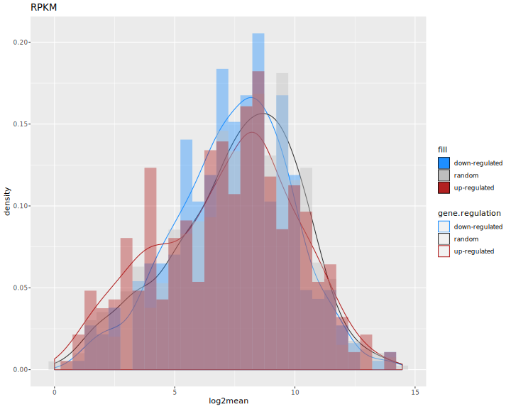
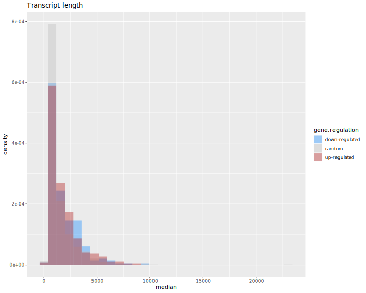
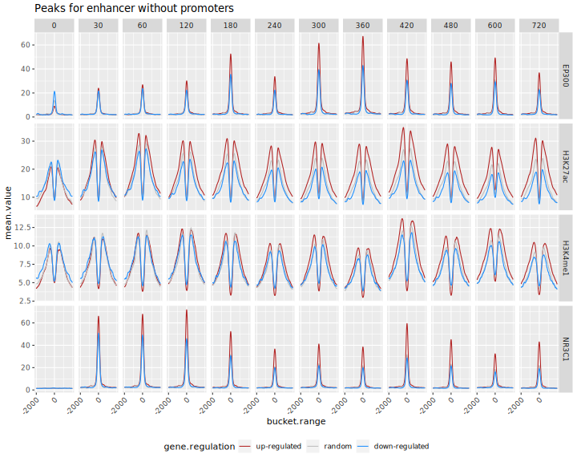
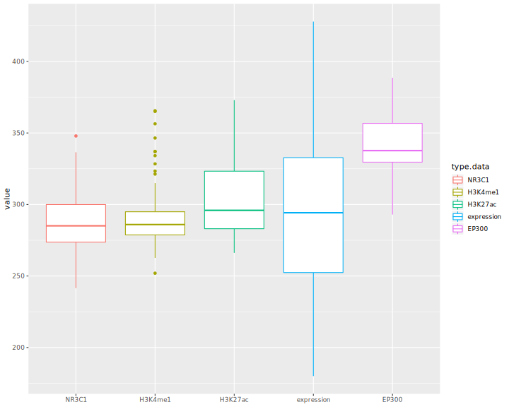

# ifpan-chipseq-timecourse
---

  

### RNA-seq

RNA-seq data from the ENCODE project were downloaded with [this link](https://www.ncbi.nlm.nih.gov/gds/?term=tim+reddy+dexamethasone+rna-seq) saved as `info-RNA-seq-to-download.txt` in `DATA`. See [this file](DATA/downloads.MD) for details on how the data was downloaded.

[analysis_transcriptome.R](https://github.com/ippas/ifpan-chipseq-timecourse/blob/master/SCRIPTS/analysis_transcriptome.R) contains RNAseq analysis code:

1. Downloaded data are loaded (including data downloaded from genebank)
2. Raw read counts are normalised (normalize quantiles)
3. Differentially Expressed Genes (DEGs) are selected based on one-way ANOVA (n = 745 genes with FDR < 0.0000001 treshold)
4. DEGs are divided into two clusters - upregulated (n = 374) and downregulated (n = 371)
5. A list of random genes with similar expression levels is chosen (n = 745)
6. Following graphs are prepared: line graph, heatmap, boxplot of weighted timepoint of max change, RPKM histogram (calculated according to [this info](https://www.biostars.org/p/273537/), transcript length histogram (accordint to: [transcript.length.tsv](https://github.com/ippas/ifpan-chipseq-timecourse/blob/master/DATA/transcript_length.tsv)
7. Additional tables for further analyses are prepared: [promotores_peaks_info.tsv]()https://github.com/ippas/ifpan-chipseq-timecourse/blob/master/DATA/promotores_peaks_info.tsv and [enhancer_info.tsv](https://github.com/ippas/ifpan-chipseq-timecourse/blob/master/DATA/enhancer_info.tsv) do znalezienia enhancerów - these ables contain information about gene identifiers, location and cluster.






### ChIP-seq

Chip-seq data were dowloaded from [this link](https://www.ncbi.nlm.nih.gov/gds/?term=tim+reddy+dexamethasone+chip-seq+nr3c1),
The [gds_result.txt](https://github.com/ippas/ifpan-chipseq-timecourse/blob/master/DATA/info-chip-seq-to-download.txt) was downloaded and translated into a file that contained:
- TF name
- time of cell fixation
- ftp adress for data dowload

With this command:

```bash
cat ~/ifpan-chipseq-timecourse/DATA/info-chip-seq-to-download.txt | 
   sed -e 's/ /\t/g' | 
   grep -P -B 1 -A 6 "ChIP-seq\ton" | 
   grep -oP 'GSE[0-9]*|[0-9\.]*.hours | supplied\).*ChIP-seq' | 
   xargs -n5 -d'\n' | 
   sed 's/(GR)\t//' | 
   awk '{print $2 "\t" $4*60 "\t""ftp://ftp.ncbi.nlm.nih.gov/geo/series/"$6"nnn/"$7"/suppl/"$7"_RAW.tar""\t"$7}' > ~/ifpan-chipseq-timecourse/DATA/chipseq-file-info.tsv
```
files were downloaded with this command:

```bash
cat ~/ifpan-chipseq-timecourse/DATA/chipseq-file-info.tsv | 
   cut -f3 | 
   xargs -i bash -c 'wget {} -P ~/ChIP-seq/DOWNLOAD'
```

Chipseq data were extracted with [extract_data_chipseq1.sh](https://github.com/ippas/ifpan-chipseq-timecourse/blob/master/SCRIPTS/extract_data_chipseq1.sh), which:
1. using the [promotores_peaks_info.tsv](https://github.com/ippas/ifpan-chipseq-timecourse/blob/master/DATA/promotores_peaks_info.tsv) i [bigwig_genomic_bucket500_extract_normalize_to_tsv.sh [1]](#1) extract information about the attachment of transcriptional factors to DNA from range +/-10000 from transcriptional start site (TSS) and saves results to file ~/ChIP-seq/DATApromotores_peaks_value.tsv
2. Make common part for three samples file type .BED containing information about occuring peaks in the genome for NR3C1 and time equal 60 minutes.
3. Using a [enhancer_info.tsv](https://github.com/ippas/ifpan-chipseq-timecourse/blob/master/DATA/enhancer_info.tsv) containing information about range +/-100000 from TSS for each gene and done file with common part of peaks in a genome, extract peaks which interesect range set for significant and ranodm genes
4. For selected peaks using [bigwig_genomic_amplitude_extract_normalize_to_tsv.sh [2]](#2), they are pulled out amplitudes value binding TF to DNA, inside range of peak, and this data are saved to: ~/ChIP-seq/DATA/enhancer_amplitude_value.tsv.
5. For selected peaks using [bigwig_genomic_range_extract_normalize_to_tsv.sh [3]](#3), they are pulled out values binding TF to DNA for each position inside a range of peak, and this data are saved to: ~/ChIP-seq/DATA/enhancer_peaks_value.tsv


[visualization_promoters.R](https://github.com/ippas/ifpan-chipseq-timecourse/blob/master/SCRIPTS/visualization_promoters.R) using data from ~/ChIP-seq/DATA/promotores_peaks_value.tsv contains visualization gene promotets code:
1. First line graph show changes in binding TF to DNA.
2. Second line graph show changes in binding TF to DNA relative to random genes.


[visualization_amplitudes.R](https://github.com/ippas/ifpan-chipseq-timecourse/blob/master/SCRIPTS/visualization_amplitudes.R) using data from ~/ChIP-seq/DATA/enhancer_amplitude_value.tsv contains enhancers amplitude analysis code:
1. Removes peaks that intersect the range +/-2000 nucleotide from TSS
2. Calculates mean amplitudes from a 12-time course and samples and selects peak which has the strongest value. If one peak has been assigned to several genes, peak is matched to the gene to which the TSS is closer.
3. Creates a graph of amplitude changes for peaks
4. Creates a graph showing the expression and dyamics of expression
5. Calculates MWT (Mean Weighted Time) binding TF to DNA in enhancers for up-regulated genes and also calculates MCTP (Max Change Time Point) for expression of up-regulated genes and both remove outliers.
6. Creates a boxplot showing MWT and MCTP
7. Calculates basic statistics: Q1, Q2, Q3, minimum, and maximum value for MWT and MCTP and [save to](https://github.com/ippas/ifpan-chipseq-timecourse/blob/master/DATA/MWT_MCTP_basic_summary.tsv) 
8. For data MWT and MCTP do one-way ANOVA with Error(gene.name) and next make pairwise.t.test with correction "bonferroni" where are expression and NR3C1. Saves the results to [MWT_MCTP_ANOVA.txt](https://github.com/ippas/ifpan-chipseq-timecourse/blob/master/DATA/MWT_MCTP_ANOVA.txt) and [MWT_MCTP_pairwise.t.test_bonferroni.tsv](https://github.com/ippas/ifpan-chipseq-timecourse/blob/master/DATA/MWT_MCTP_pairwise.t.test_bonferroni.tsv) respectively.
9.  For selected peaks prepare file [enhancer_bigrange_info.tsv](https://github.com/ippas/ifpan-chipseq-timecourse/blob/master/DATA/enhancer_bigrange_info.tsv) with range +/-10000 nucleotide position from calculating mean position amplitude of peak, based on all timepoint except time equal zero.


[extract_data_chipseq2.sh](https://github.com/ippas/ifpan-chipseq-timecourse/blob/master/SCRIPTS/extract_data_chipseq2.sh) run with the command:

```bash
 ~/ifpan-chipseq-timecourse/SCRIPTS/./extract_data_chipseq2.sh
 ```
- Script uses [bigwig_genomic_range_extract_normalize_to_tsv_bucket10.sh [4]](#4) and [enhancer_bigrange_info.tsv](https://github.com/ippas/ifpan-chipseq-timecourse/blob/master/DATA/enhancer_bigrange_info.tsv), and extracts value TF binding to DNA in the ranges given in a file


Download the gtf file using command:

```bash
wget  ftp://ftp.ebi.ac.uk/pub/databases/gencode/Gencode_human/release_36/gencode.v36.annotation.gtf.gz
```

Using command below select genes encoding proteins and save to [Homo_sapiens.GRCh38.95.protein_coding.gtf](https://github.com/ippas/ifpan-chipseq-timecourse/blob/master/DATA/Homo_sapiens.GRCh38.95.protein_coding.gtf):

```bash
zcat ~/ChIP-seq/DATA/gencode.v36.annotation.gtf | 
    grep "gene_type \"protein_coding\"" | 
    awk '{print $10"\t"$16}' | 
    sort -u | 
    grep -v "[1-3];" | 
    sed 's/"//g' | 
    sed 's/;//g' | 
    sed 's/\./\t/' | 
    cut -f1,3 > ~/ifpan-chipseq-timecourse/DATA/Homo_sapiens.GRCh38.95.protein_coding.gtf
```


[visualization_enhancer_range.R](https://github.com/ippas/ifpan-chipseq-timecourse/blob/master/SCRIPTS/visualization_enhancer_range.R) using data from ~/ChIP-seq/DATA/enhancer_bigrange_value.tsv contains enhancer analysis code:
1. Creates a line graph showing changes in binding TF to DNA +/-2000 from amplitude in peak
2. Create line graph showing chages in binding TF to DNA relative to random genes.
3. Calculate two-way ANOVA where time and gene.regulation are factors, next make pairwise.t.test between time equla zero and each other time and also pairwise.t.test between gene.regulation, then results are saved to [enhancer_relative_amplitude_ANOVA.txt](https://github.com/ippas/ifpan-chipseq-timecourse/blob/master/DATA/enhancer_relative_amplitude_ANOVA.txt), [enhancer_post_hoc_between_time.tsv](https://github.com/ippas/ifpan-chipseq-timecourse/blob/master/DATA/enhancer_post_hoc_between_time.tsv), [enhancer_post_hoc_between_regulation.tsv](https://github.com/ippas/ifpan-chipseq-timecourse/blob/master/DATA/enhancer_post_hoc_between_regulation.tsv) respectively.
4. Creates heatmap showing for each gene changes in binding TF to DNA +/-2000 from amplitude in peak. 
5. Loads the [Homo_sapiens.GRCh38.95.protein_coding.gtf](https://github.com/ippas/ifpan-chipseq-timecourse/blob/master/DATA/Homo_sapiens.GRCh38.95.protein_coding.gtf) based on which prepares the [range_all_genes.bed](https://github.com/ippas/ifpan-chipseq-timecourse/blob/master/DATA/range_all_genes.bed) with ranges +/-100000 nucleotide position from TSS for each gene coding protein.





Run [extract_data_chipseq3.sh](https://github.com/ippas/ifpan-chipseq-timecourse/blob/master/SCRIPTS/extract_data_chipseq3.sh) using command:

```bash
 ~/ifpan-chipseq-timecourse/SCRIPTS/./extract_data_chipseq3.sh
 ```
Script executes:
1. Make common part for three samples file type .BED containing information about occuring peaks in the genome for NR3C1 and time equal 60 minutes.
2. Finds peaks for genes in the ranges given in the [range_all_genes.bed](https://github.com/ippas/ifpan-chipseq-timecourse/blob/master/DATA/range_all_genes.bed).
3. For finds peaks using [bigwig_genomic_amplitude_extract_normalize_to_tsv.NR3C1-EP300.sh [5]](#5) extract amplitude value binding TF inside for each peak and save to ~/ChIP-seq/DATA/enhancer_amplitude_value.tsv.


### Analiza EP300 

[delta_ep300.R](https://github.com/ippas/ifpan-chipseq-timecourse/blob/master/SCRIPTS/delta_ep300.R) contains code:
1. Read ~/ChIP-seq/DATA/peaks_all_genes_ep300_nr3c1_amplitude.tsv
2. Calculates the difference between the minimum and maximum values for each peak. If one peak has been assigned to several genesm it is assigned to the closest TSS gene and if more than one peaks have been assigned to one gene, the peak colsest to the TSS gene has been selected. In the end, it chooses the 100 genes with the biggest difference.
3. Create a heatmap of expression for selected genes.
4. Selected genes are divided into two clusters down-delta-ep300 (n = 15) and up-delta-ep300 (n = 85)
5. Calculates MWT binding TF to DNA in enhancer for up-delta-ep300 genes and also calculates MCTP for expression of up-delta-ep300 genes and both remove outliers.
6. Creates a boxplot showing MWT and MCTP
7. Calculates basic statistics: Q1, Q2, Q3 , minimum and maximum value for MWT and MCTP [save to](https://github.com/ippas/ifpan-chipseq-timecourse/blob/master/DATA/MWT_MCTP_delta_ep300_basic_summary.tsv) 
8. For data MWT and MCTP do one-way ANOVA with Eroor(gene.name) and next make pairwise.t.test with correction "bonferroni" where are expression and NR3C1. Saves the results to [MWT_MCTP_delta_ep300_ANOVA.txt](https://github.com/ippas/ifpan-chipseq-timecourse/blob/master/DATA/MWT_MCTP_delta_ep300_ANOVA.txt) and [MWT_MCTP_delta_ep300_pairwise.t.test_bonferroni.tsv](https://github.com/ippas/ifpan-chipseq-timecourse/blob/master/DATA/MWT_MCTP_delta_ep300_pairwise.t.test_bonferroni.tsv) respectively.
9. Creates a combined MWT and MCTP bocplot for upregulated and up-delta-ep300 genes.
10. Calculates two-way ANOVA between type genes (upregulated or up-delta-ep300) and inside MWT and MCTP, next do pairwise.t.tes between upregulated and up-delta-ep300. Results save to [MWT_MCTP_upregulated_delta_ep300_ANOVA.txt](https://github.com/ippas/ifpan-chipseq-timecourse/blob/master/DATA/MWT_MCTP_upregulated_delta_ep300_ANOVA.txt) and [upregulated_delta_ep300_pairwise.t.test.tsv](https://github.com/ippas/ifpan-chipseq-timecourse/blob/master/DATA/upregulated_delta_ep300_pairwise.t.test.tsv) respectively.
11. Creates boxplot expression for up-delta-ep300 genes and also line showing dynamic expression.
12. Creates boxplot amplitude value binding EP300 and NR3C1 to enhancer for up-delta-ep300 genes.
13. For selected peaks prepare file [enhancer_delta_ep300_info.tsv](https://github.com/ippas/ifpan-chipseq-timecourse/blob/master/DATA/enhancer_delta_ep300_info.tsv) which contains the infromation to extract data of TF binding to entire peak range.





[extract_data_chipseq1_ep300.sh](https://github.com/ippas/ifpan-chipseq-timecourse/blob/master/SCRIPTS/extract_data_chipseq1_ep300.sh) executes:
1. Extracts values of TF binding over the entire peak range using [enhancer_delta_ep300_info.tsv](https://github.com/ippas/ifpan-chipseq-timecourse/blob/master/DATA/enhancer_delta_ep300_info.tsv) and [bigwig_genomic_range_extract_normalize_to_tsv.sh [3]](#3).
2. Results save to ~/ChIP-seq/DATA/enhancer_peaks_delta_ep300.tsv


[centering_peaks_ep300.sh](https://github.com/ippas/ifpan-chipseq-timecourse/blob/master/SCRIPTS/centering_peaks_ep300.R) contains code:
1. read  ~/ChIP-seq/DATA/enhancer_peaks_delta_ep300.tsv.
2. Based on NR3C1 binding to enhancers calculates the mean peak center for the time points excluding time equal zero.
3. Creates [enhancer_bigrange_delta_ep300_info.tsv](https://github.com/ippas/ifpan-chipseq-timecourse/blob/master/DATA/enhancer_bigrange_delta_ep300_info.tsv) with ranges of +/-10000 position nucleotide from the calculated peak center.


[extract_data_chipseq2_ep300.sh](https://github.com/ippas/ifpan-chipseq-timecourse/blob/master/SCRIPTS/extract_data_chipseq2_ep300.sh) executes:
1. Using [extract_data_chipseq2_ep300.sh](https://github.com/ippas/ifpan-chipseq-timecourse/blob/master/SCRIPTS/extract_data_chipseq2_ep300.sh) extract values binding TF to DNA in range contained in [enhancer_bigrange_delta_ep300_info.tsv](https://github.com/ippas/ifpan-chipseq-timecourse/blob/master/DATA/enhancer_bigrange_delta_ep300_info.tsv).
2. Results save to ~/ChIP-seq/DATA/enhancer_bigrange_delta_ep300.tsv.


[analysis_enhancer_range_ep300.R](https://github.com/ippas/ifpan-chipseq-timecourse/blob/master/SCRIPTS/analysis_enhancer_range_ep300.R) contain analysis code:
1. Read data from ~/ChIP-seq/DATA/enhancer_bigrange_delta_ep300.tsv.
2. Creata a line graph showing changes in binding TF to DNA +/-2000 from amplitude in peak.
3. Creates heatmap showing for each gene changes  in binding TF to DNA +/-2000 from amplitude in peak


Scripts were used to extract data for chip-seq from type bigWig files:

<a id="1">[1]</a> [bigwig_genomic_bucket500_extract_normalize_to_tsv.sh](https://github.com/ippas/ifpan-chipseq-timecourse/blob/master/SCRIPTS/bigwig_genomic_bucket500_extract_normalize_to_tsv.sh)
1. Extracts values in the range of 20001 position nucleotide, the result collects 500 items and calculates the mean to reduce the amount of data and eliminate noise, in the case of the last collection, it counts the mean of 501 items.
2. To extract data it uses [bigWigToBedGraph](https://github.com/ippas/ifpan-chipseq-timecourse/blob/master/SCRIPTS/bigWigToBedGraph) [downloaded form](http://hgdownload.soe.ucsc.edu/admin/exe/linux.x86_64.v369/)
3. Extracts data fro all TF found in [chipseq-file-info.tsv](https://github.com/ippas/ifpan-chipseq-timecourse/blob/master/DATA/chipseq-file-info.tsv)

<a id="2">[2]</a> [bigwig_genomic_amplitude_extract_normalize_to_tsv.sh](https://github.com/ippas/ifpan-chipseq-timecourse/blob/master/SCRIPTS/bigwig_genomic_amplitude_extract_normalize_to_tsv.sh)
1. In the given range extracts amplitudes value from type bigwig files.
2. To extract amplitude value it uses [bigWigSummary](https://github.com/ippas/ifpan-chipseq-timecourse/blob/master/SCRIPTS/bigWigSummary) [downloaded form](http://hgdownload.soe.ucsc.edu/admin/exe/linux.x86_64.v369/)
3. Extracts data for all TF found in [chipseq-file-info.tsv](https://github.com/ippas/ifpan-chipseq-timecourse/blob/master/DATA/chipseq-file-info.tsv)

<a id="3">[3]</a> [bigwig_genomic_range_extract_normalize_to_tsv.sh](https://github.com/ippas/ifpan-chipseq-timecourse/blob/master/SCRIPTS/bigwig_genomic_range_extract_normalize_to_tsv.sh)
1. In the given range extracts the values for each nucleotide position.
2. To extract data it ueses [bigWigToBedGraph](https://github.com/ippas/ifpan-chipseq-timecourse/blob/master/SCRIPTS/bigWigToBedGraph) [downloaded form](http://hgdownload.soe.ucsc.edu/admin/exe/linux.x86_64.v369/)
3. Extracts data for four TF: EP300, H3K27ac, H3K4me1, NR3C1

<a id="4">[4]</a> [bigwig_genomic_range_extract_normalize_to_tsv_bucket10.sh](https://github.com/ippas/ifpan-chipseq-timecourse/blob/master/SCRIPTS/bigwig_genomic_range_extract_normalize_to_tsv_bucket10.sh)
1. Extracts values in the range of 20001 position nucleotide, the result collects 10 items and calculates the mean to reduce the amount of data and eliminate noise, in the case of the last collection, it counts the mean of 11 items.
2. To extract data it uses [bigWigToBedGraph](https://github.com/ippas/ifpan-chipseq-timecourse/blob/master/SCRIPTS/bigWigToBedGraph) [downloaded form](http://hgdownload.soe.ucsc.edu/admin/exe/linux.x86_64.v369/).
3. Extracts data for four TF: EP300, H3K27ac, H3K4me1, NR3C1

<a id="5">[5]</a> [bigwig_genomic_amplitude_extract_normalize_to_tsv.NR3C1-EP300.sh](https://github.com/ippas/ifpan-chipseq-timecourse/blob/master/SCRIPTS/bigwig_genomic_amplitude_extract_normalize_to_tsv.NR3C1-EP300.sh)
1. In the given range extracts amplitudes value from type bigwig files.
2. To extract amplitude value it uses [bigWigSummary](https://github.com/ippas/ifpan-chipseq-timecourse/blob/master/SCRIPTS/bigWigSummary) [downloaded form](http://hgdownload.soe.ucsc.edu/admin/exe/linux.x86_64.v369/).
3. Extracts data for four TF: EP300, H3K27ac, H3K4me1, NR3C1

The above scripts perform data normalization using scripts:
1. [bigWigToBedGraph](https://github.com/ippas/ifpan-chipseq-timecourse/blob/master/SCRIPTS/bigWigToBedGraph) [downloaded form](http://hgdownload.soe.ucsc.edu/admin/exe/linux.x86_64.v369/)
2. [normalize_bedgraph.py](https://github.com/ippas/ifpan-chipseq-timecourse/blob/master/SCRIPTS/normalize_bedgraph.py) [downloaded form](https://github.com/porchard/normalize_bedgraph)
3. [bedGraphToBigWig](https://github.com/ippas/ifpan-chipseq-timecourse/blob/master/SCRIPTS/bedGraphToBigWig) [downloaded form](http://hgdownload.soe.ucsc.edu/admin/exe/linux.x86_64.v369/)

