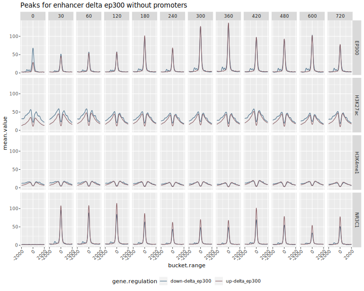
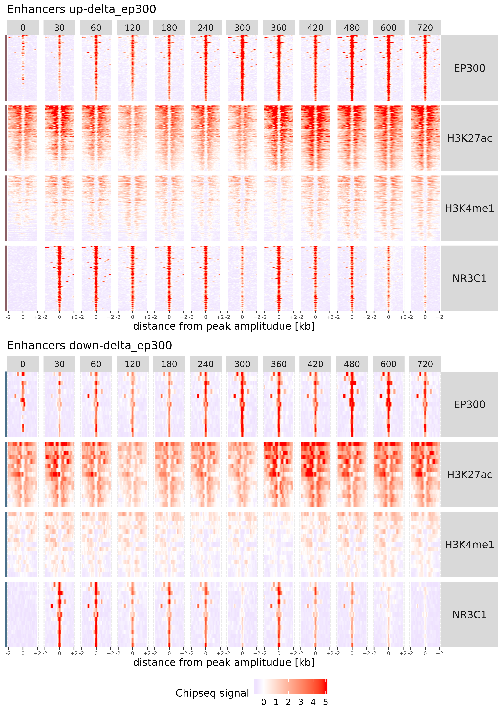

# ifpan-chipseq-timecourse
---

  

### RNA-seq

RNA-seq data from the ENCODE project were downloaded with [this link](https://www.ncbi.nlm.nih.gov/gds/?term=tim+reddy+dexamethasone+rna-seq) saved as `info-RNA-seq-to-download.txt` in `DATA`. See [this file](DATA/downloads.MD) for details on how the data was downloaded.

[analysis_transcriptome.R](https://github.com/ippas/ifpan-chipseq-timecourse/blob/master/SCRIPTS/analysis_transcriptome.R) contains RNAseq analysis code:

1. Downloaded data are loaded (including data downloaded from genebank)
2. Raw read counts are normalised (normalize quantiles)
3. Differentially Expressed Genes (DEGs) are selected based on one-way ANOVA (n = 745 genes with FDR < 0.0000001 treshold)
4. DEGs are divided into two clusters - upregulated (n = 374) and downregulated (n = 371)
5. A list of random genes with similar expression levels is chosen (n = 745)
6. Following graphs are prepared: line graph, heatmap, boxplot of weighted timepoint of max change, RPKM histogram (calculated according to [this info](https://www.biostars.org/p/273537/), transcript length histogram (accordint to: [transcript.length.tsv](https://github.com/ippas/ifpan-chipseq-timecourse/blob/master/DATA/transcript_length.tsv)
7. Additional tables for further analyses are prepared: [promotores_peaks_info.tsv]()https://github.com/ippas/ifpan-chipseq-timecourse/blob/master/DATA/promotores_peaks_info.tsv and [enhancer_info.tsv](https://github.com/ippas/ifpan-chipseq-timecourse/blob/master/DATA/enhancer_info.tsv) do znalezienia enhancerów - these ables contain information about gene identifiers, location and cluster.


### ChIP-seq

Chip-seq data were dowloaded from [this link](https://www.ncbi.nlm.nih.gov/gds/?term=tim+reddy+dexamethasone+chip-seq+nr3c1),
The [gds_result.txt](https://github.com/ippas/ifpan-chipseq-timecourse/blob/master/DATA/info-chip-seq-to-download.txt) was downloaded and translated into a file that contained:
- TF name
- time of cell fixation
- ftp adress for data dowload

With this command:

```bash
cat ~/ifpan-chipseq-timecourse/DATA/info-chip-seq-to-download.txt | 
   sed -e 's/ /\t/g' | 
   grep -P -B 1 -A 6 "ChIP-seq\ton" | 
   grep -oP 'GSE[0-9]*|[0-9\.]*.hours | supplied\).*ChIP-seq' | 
   xargs -n5 -d'\n' | 
   sed 's/(GR)\t//' | 
   awk '{print $2 "\t" $4*60 "\t""ftp://ftp.ncbi.nlm.nih.gov/geo/series/"$6"nnn/"$7"/suppl/"$7"_RAW.tar""\t"$7}' > ~/ifpan-chipseq-timecourse/DATA/chipseq-file-info.tsv
```
files were downloaded with this command:

```bash
cat ~/ifpan-chipseq-timecourse/DATA/chipseq-file-info.tsv | 
   cut -f3 | 
   xargs -i bash -c 'wget {} -P ~/ChIP-seq/DOWNLOAD'
```

Chipseq data were extracted with [extract_data_chipseq1.sh)](https://github.com/ippas/ifpan-chipseq-timecourse/blob/master/SCRIPTS/extract_data_chipseq1.sh), which:
1. using the [promotores_peaks_info.tsv](https://github.com/ippas/ifpan-chipseq-timecourse/blob/master/DATA/promotores_peaks_info.tsv) i [bigwig_genomic_bucket500_extract_normalize_to_tsv.sh [1]](#1) extract information about the attachment of transcriptional factors to DNA from range +/-10000 from transcriptional start site (TSS) and saves results to file ~/ChIP-seq/DATApromotores_peaks_value.tsv
2. Make common part for three samples file type .BED containing information about occuring peaks in the genome for NR3C1 and time equal 60 minutes.
3. Using a [enhancer_info.tsv](https://github.com/ippas/ifpan-chipseq-timecourse/blob/master/DATA/enhancer_info.tsv) containing information about range +/-100000 from TSS for each gene and done file with common part of peaks in a genome, extract peaks which interesect range set for significant and ranodm genes
4. For selected peaks using [bigwig_genomic_amplitude_extract_normalize_to_tsv.sh [2]](#2), they are pulled out amplitudes value binding TF to DNA, inside range of peak, and this data are saved to: ~/ChIP-seq/DATA/enhancer_amplitude_value.tsv.
5. For selected peaks using [bigwig_genomic_range_extract_normalize_to_tsv.sh [3]](#3), they are pulled out values binding TF to DNA for each position inside a range of peak, and this data are saved to: ~/ChIP-seq/DATA/enhancer_peaks_value.tsv


[visualization_promoters.R](https://github.com/ippas/ifpan-chipseq-timecourse/blob/master/SCRIPTS/visualization_promoters.R) using data from ~/ChIP-seq/DATA/promotores_peaks_value.tsv contains visualization gene promotets code:
1. First line graph show changes in binding TF to DNA.
2. Second line graph show changes in binding TF to DNA relative to random genes.


3. Uruchomić skrypt [visualization_promoters.R](https://github.com/ippas/ifpan-chipseq-timecourse/blob/master/SCRIPTS/visualization_promoters.R), który wykonuje wykresy:
- wczytuje plik ~/ChIP-seq/DATA/promotores_peaks_value.tsv, który jest wynikiem skryptu [extract_data_chipseq1.sh](https://github.com/ippas/ifpan-chipseq-timecourse/blob/master/SCRIPTS/extract_data_chipseq1.sh)
- wykres liniowy predstawiający średnią z grupy przyłączenia się TF (wybrane cztery TF: EP300, H3K27ac, H3K4me1, NR3C1) do promotorów w pozycjach =/- 10000 od TSS,
- wykres liniowy predstawiający średnią z grupy przyłączenia się TF (wybrane cztery TF: EP300, H3K27ac, H3K4me1, NR3C1) do promotorów w pozycjach =/- 10000 od TSS, w odniesieniu do genów z grupy random


[visualization_amplitudes.R](https://github.com/ippas/ifpan-chipseq-timecourse/blob/master/SCRIPTS/visualization_amplitudes.R) using data from ~/ChIP-seq/DATA/enhancer_amplitude_value.tsv contains enhancers amplitude analysis code:
1. Removes peaks that intersect the range +/-2000 nucleotide from TSS
2. Calculates mean amplitudes from a 12-time course and samples and selects peak which has the strongest value. If one peak has been assigned to several genes, peak is matched to the gene to which the TSS is closer.
3. Creates a graph of amplitude changes for peaks
4. Creates a graph showing the expression and dyamics of expression
5. Calculates MWT (Mean Weighted Time) binding TF to DNA in enhancers for up-regulated genes and also calculates MCTP (Max Change Time Point) for expression of up-regulated genes and both remove outliers.
6. Creates a boxplot showing MWT and MCTP
7. Calculates vasic statistics: Q1, Q2, Q3, minimum, and maximum value for MWT and MCTP and [save to](https://github.com/ippas/ifpan-chipseq-timecourse/blob/master/DATA/MWT_MCTP_basic_summary.tsv) 
8. For data MWT and MCTP do one-way ANOVA with Error(gene.name) and next make pairwise.t.test with correction "bonferroni" where are expression and NR3C1. Saves the results to [MWT_MCTP_ANOVA.txt](https://github.com/ippas/ifpan-chipseq-timecourse/blob/master/DATA/MWT_MCTP_ANOVA.txt) and [zapisuje do](https://github.com/ippas/ifpan-chipseq-timecourse/blob/master/DATA/MWT_MCTP_pairwise.t.test_bonferroni.tsv) respectively.
9.  For selected peaks prepare file [enhancer_bigrange_info.tsv](https://github.com/ippas/ifpan-chipseq-timecourse/blob/master/DATA/enhancer_bigrange_info.tsv) with range +/-10000 nucleotide position from calculating mean position amplitude of peak, based on all timepoint except time equal zero.


4. Uruchomić skrypt [visualization_amplitudes.R](https://github.com/ippas/ifpan-chipseq-timecourse/blob/master/SCRIPTS/visualization_amplitudes.R), który:
- wczytuje plik ~/ChIP-seq/DATA/enhancer_amplitude_value.tsv, będący wynikiem skryptu [extract_data_chipseq1.sh](https://github.com/ippas/ifpan-chipseq-timecourse/blob/master/SCRIPTS/extract_data_chipseq1.sh)
- usuwa peaki które nachodzą na zakres +/- 2000 od TSS
- wybiera najsilniejszy peak z pośród zbioru peaków przypisanych do jednego genu. Wybranie najsilniejszych odbywa się poprzes obliczenie średniej amplitudy z 12 punktów czasowych we wszystkich próbkach, i najsilniejszy peak to ten który posiada najwyższą średnią
- w przypadku gdy jeden peak został przypisany do kilku genów, to wybierany jest ten gen który znajduje się najbliżej TSS, pozostałe peaki zostają usunięte
- tworzy wykres zmian amplitud z przłączania TF (NR3C1, EP300, H3K27ac, H3K4me1) w przygotowancyh peakach, zpodziałem na up-regulated i down-regulated 
- wykonuje boxplot ekspresji genów up-regulated oraz linię przedstawiającą pochodną ekspresji tych genów
- wykonuje boxplot amplitud przyłączania się EP300 i NR3C1 do enhancerów dla genów up-regulated
- oblicza mean weighted time (MWT) przyłączania TF (NR3C1, EP300, H3K27ac, H3K4me1) do enhancerów w genach uprulowanych
- oblicza max change time point (MCTP) dla expressji genów upregulowanych dla których zostały wybrane enhancery
- tworzy boxplot na którym zostaje przedstawiony mean weighted time przyłączania TF oraz max change time point ekspressji genów upregulowanych 
- oblicza dla MWT i MCTP minimalną wartość kwantyle: Q1, Q2, Q3 i maksymalną wartość i zapisuje [do plikue](https://github.com/ippas/ifpan-chipseq-timecourse/blob/master/DATA/MWT_MCTP_basic_summary.tsv)
- wykonuje jednoczynnikową ANOVE z poprawką z poprawką na błąd Error(gene.name), a wynik za [pisuje do](https://github.com/ippas/ifpan-chipseq-timecourse/blob/master/DATA/MWT_MCTP_ANOVA.txt)
- wykonuje pairwise.t.test i wykonuje poprawkę bonferroniego w porównaniach gdzie występuje expression i NR3C1 i tabelę [zapisuje do](https://github.com/ippas/ifpan-chipseq-timecourse/blob/master/DATA/MWT_MCTP_pairwise.t.test_bonferroni.tsv)
- dla wybranych peaków przygotowuje plik [enhancer_bigrange_info.tsv](https://github.com/ippas/ifpan-chipseq-timecourse/blob/master/DATA/enhancer_bigrange_info.tsv) z zakresem +/- 10000 pozycji nukleotydów od wyliczonej średniej pozycji amplitudy w peaku na podstawie wszystkich timepointów z wyłączenie time = 0


[extract_data_chipseq2.sh](https://github.com/ippas/ifpan-chipseq-timecourse/blob/master/SCRIPTS/extract_data_chipseq2.sh) run with the command:

```bash
 ~/ifpan-chipseq-timecourse/SCRIPTS/./extract_data_chipseq2.sh
 ```
- Script uses [bigwig_genomic_range_extract_normalize_to_tsv_bucket10.sh [4]](#4) and [enhancer_bigrange_info.tsv](https://github.com/ippas/ifpan-chipseq-timecourse/blob/master/DATA/enhancer_bigrange_info.tsv), and extracts value TF binding to DNA in the ranges given in a file


Uruchomić [extract_data_chipseq2.sh](https://github.com/ippas/ifpan-chipseq-timecourse/blob/master/SCRIPTS/extract_data_chipseq2.sh) komendą:

```bash
 ~/ifpan-chipseq-timecourse/SCRIPTS/./extract_data_chipseq2.sh
 ```
- skrypt korzysta z [bigwig_genomic_range_extract_normalize_to_tsv_bucket10.sh [4]](#4) i pliku [enhancer_bigrange_info.tsv](https://github.com/ippas/ifpan-chipseq-timecourse/blob/master/DATA/enhancer_bigrange_info.tsv), zostają wyciągnięte dane dla enhancerów w zakresie +/-10000 od środka peaku i zapisane do pliku ~/ChIP-seq/DATA/enhancer_bigrange_value.tsv


Download the gtf file using command:

```bash
wget  ftp://ftp.ebi.ac.uk/pub/databases/gencode/Gencode_human/release_36/gencode.v36.annotation.gtf.gz
```

Using command below select genes encoding proteins and save to [Homo_sapiens.GRCh38.95.protein_coding.gtf](https://github.com/ippas/ifpan-chipseq-timecourse/blob/master/DATA/Homo_sapiens.GRCh38.95.protein_coding.gtf):

```bash
zcat ~/ChIP-seq/DATA/gencode.v36.annotation.gtf | 
    grep "gene_type \"protein_coding\"" | 
    awk '{print $10"\t"$16}' | 
    sort -u | 
    grep -v "[1-3];" | 
    sed 's/"//g' | 
    sed 's/;//g' | 
    sed 's/\./\t/' | 
    cut -f1,3 > ~/ifpan-chipseq-timecourse/DATA/Homo_sapiens.GRCh38.95.protein_coding.gtf
```


Przy pomocy komendy ściągnięto plik gtf:

Następnie wybrano geny kodujące białka i zapisuje do [Homo_sapiens.GRCh38.95.protein_coding.gtf](https://github.com/ippas/ifpan-chipseq-timecourse/blob/master/DATA/Homo_sapiens.GRCh38.95.protein_coding.gtf):

[visualization_enhancer_range.R](https://github.com/ippas/ifpan-chipseq-timecourse/blob/master/SCRIPTS/visualization_enhancer_range.R) using data from ~/ChIP-seq/DATA/enhancer_bigrange_value.tsv contains enhancer analysis code:
1. Creates a line graph showing changes in binding TF to DNA +/-2000 from amplitude in peak
2. Create line graph showing chages in binding TF to DNA relative to random genes.
3. Calculate two-way ANOVA where time and gene.regulation are factors, next make pairwise.t.test between time equla zero and each other time and also pairwise.t.test between gene.regulation, then results are saved to [enhancer_relative_amplitude_ANOVA.txt](https://github.com/ippas/ifpan-chipseq-timecourse/blob/master/DATA/enhancer_relative_amplitude_ANOVA.txt), [enhancer_post_hoc_between_time.tsv](https://github.com/ippas/ifpan-chipseq-timecourse/blob/master/DATA/enhancer_post_hoc_between_time.tsv), [enhancer_post_hoc_between_regulation.tsv](https://github.com/ippas/ifpan-chipseq-timecourse/blob/master/DATA/enhancer_post_hoc_between_regulation.tsv) respectively.
4. Creates heatmap showing for each gene changes in binding TF to DNA +/-2000 from amplitude in peak. 
5. Loads the [Homo_sapiens.GRCh38.95.protein_coding.gtf](https://github.com/ippas/ifpan-chipseq-timecourse/blob/master/DATA/Homo_sapiens.GRCh38.95.protein_coding.gtf) based on which prepares the [range_all_genes.bed](https://github.com/ippas/ifpan-chipseq-timecourse/blob/master/DATA/range_all_genes.bed) with ranges +/-100000 nucleotide position from TSS for each gene coding protein.


- wczytuje plik ~/ChIP-seq/DATA/enhancer_bigrange_value.tsv, będący wynikiem skryptu [extract_data_chipseq2.sh](https://github.com/ippas/ifpan-chipseq-timecourse/blob/master/SCRIPTS/extract_data_chipseq2.sh)
- wykres liniowy predstawiający średnią z grupy przyłączenia się TF (wybrane cztery TF: EP300, H3K27ac, H3K4me1, NR3C1) do enhancerów w pozycjach +/- 2000 od wyznaczonego środka peaku,
- wykres liniowy predstawiający średnią z grupy przyłączenia się TF (wybrane cztery TF: EP300, H3K27ac, H3K4me1, NR3C1) do enhancerów w pozycjach +/- 2000 od wyznaczonego środka peaku, w odniesieniu do peaków z grupy random
- wykonuje dwczuczynnikową ANOVE na każdym z TF (NR3C1, EP300, H3K37ac, H3K4me1) uwzględniając jako czynniki time i gene.regulation, a wynik [zapisuje do](https://github.com/ippas/ifpan-chipseq-timecourse/blob/master/DATA/enhancer_relative_amplitude_ANOVA.txt)
- wykonuje pairwaise.t.test dla wcześniejszej ANOVY gdzie porównuje dane z każdego czasu w konkretnym TF do time = 0, a wynik [zapisuje do](https://github.com/ippas/ifpan-chipseq-timecourse/blob/master/DATA/enhancer_post_hoc_between_time.tsv)
- wykonuje pairwaise.t.test dla wcześniejszej ANOVY gdzie porównuje dane pomiędzy up-regulation i down-regulation w tym samym czasie i TF i tabelę z wynikami [zapisuje do](https://github.com/ippas/ifpan-chipseq-timecourse/blob/master/DATA/enhancer_post_hoc_between_regulation.tsv)
- wykonuje heatmape przedstawiając przyłączania się TF (EP300, H3k27ac, H3K4me1, NR3C1) do enhancerów w pozycjach +/- 2000 od wyznaczonego środka peaku dla genów up-regulated, randomowych i down-regulated
- wczytuje [Homo_sapiens.GRCh38.95.protein_coding.gtf](https://github.com/ippas/ifpan-chipseq-timecourse/blob/master/DATA/Homo_sapiens.GRCh38.95.protein_coding.gtf) zawierający nazwy genów kodujących białka i ich numery ensemblid 
- przygotowuje plik [range_all_genes.bed](https://github.com/ippas/ifpan-chipseq-timecourse/blob/master/DATA/range_all_genes.bed) z zakresem +/- 100000 pozycji nukleotydów od TSS genów kodujących białka, plik jest potrzebny do znalezienia peaków nachodzących w tym zakresie


Run [extract_data_chipseq3.sh](https://github.com/ippas/ifpan-chipseq-timecourse/blob/master/SCRIPTS/extract_data_chipseq3.sh) using command:

```bash
 ~/ifpan-chipseq-timecourse/SCRIPTS/./extract_data_chipseq3.sh
 ```
Script executes:
1. Make common part for three samples file type .BED containing information about occuring peaks in the genome for NR3C1 and time equal 60 minutes.
2. Finds peaks for genes in the ranges given in the [range_all_genes.bed](https://github.com/ippas/ifpan-chipseq-timecourse/blob/master/DATA/range_all_genes.bed).
3. For finds peaks using [bigwig_genomic_amplitude_extract_normalize_to_tsv.NR3C1-EP300.sh [5]](#5) extract amplitude value binding TF inside for each peak and save to ~/ChIP-seq/DATA/enhancer_amplitude_value.tsv.


Uruchomić skrypt [extract_data_chipseq3.sh](https://github.com/ippas/ifpan-chipseq-timecourse/blob/master/SCRIPTS/extract_data_chipseq3.sh) komendą:

 - korzystając z bedtools intersect i trzech próbek tworzy część wspólną peaków w genomie dla NR3C1 dla time = 60
 - przy pomocy wyznaczonej części wspólnej próbek, wyciąga enhancery znajdujące się w zakresach znajdujących się w [range_all_genes.bed](https://github.com/ippas/ifpan-chipseq-timecourse/blob/master/DATA/range_all_genes.bed) (+/-100000 od TSS)
 - dla wybranych enhancerów korzystając z [bigwig_genomic_amplitude_extract_normalize_to_tsv.NR3C1-EP300.sh [5]](#5) wyciąga maksymalną wartość przyłączania się TF (NR3C1 i EP300) do peaku i zapisuje dane do: ~/ChIP-seq/DATA/enhancer_amplitude_value.tsv 


### Analiza EP300 

[delta_ep300.R](https://github.com/ippas/ifpan-chipseq-timecourse/blob/master/SCRIPTS/delta_ep300.R) contains code:
1. Read ~/ChIP-seq/DATA/peaks_all_genes_ep300_nr3c1_amplitude.tsv
2. Calculates the difference between the minimum and maximum values for each peak. If one peak has been assigned to several genesm it is assigned to the closest TSS gene and if more than one peaks have been assigned to one gene, the peak colsest to the TSS gene has been selected. In the end, it chooses the 100 genes with the biggest difference.


Uruchomić skrypt [delta_ep300.R](https://github.com/ippas/ifpan-chipseq-timecourse/blob/master/SCRIPTS/delta_ep300.R), którego kod wykonuje:
- wczytuje ~/ChIP-seq/DATA/peaks_all_genes_ep300_nr3c1_amplitude.tsv będący wynikiem [extract_data_chipseq3.sh](https://github.com/ippas/ifpan-chipseq-timecourse/blob/master/SCRIPTS/extract_data_chipseq3.sh) i usuwa peaki które nachodzą na zakres +/- 2000 od TSS
- oblicza różnicę pomiędzy maksymalną wartością amplitudy a miniwalną wartością amplitudy dla EP300
- sortuje obliczoną różnicę od największej do najmniejszej, 
- w przypadku gdy zostało przypisane kilka genów do jednego peaku, to wybiera ten gen którego TSS jest najbliżej peaku
- w przypakdu gdy do jednego genu zostało przypisane kilka peaków, to wybiera ten peak który znajduje się bliżej TSS
- wybiera 100 peaków z wcześniej obliczoną różnicą

- wykonuje heatmape ekspressji dla wybranych 100 genów
- dokonuje podziału na dwa klastry down-delta_ep300 i up-delta_ep300
- tworzy wykres zmian amplitud z przłączania TF (NR3C1, EP300) w przygotowancyh peakach, zpodziałem na up-delta_ep300 i down-delta_ep300
- oblicza mean weighted time (MWT) przyłączania TF (NR3C1, EP300, H3K27ac, H3K4me1) do enhancerów w genach up-delta_ep300
- oblicza max change time point (MCTP) dla expressji genów up-delta_ep300 dla których zostały wybrane enhancery
- oblicza dla MWT i MCTP minimalną wartość kwantyle: Q1, Q2, Q3 i maksymalną wartość i zapisuje [do pliku](https://github.com/ippas/ifpan-chipseq-timecourse/blob/master/DATA/MWT_MCTP_delta_ep300_basic_summary.tsv)
- wykonuje one-way ANOVE dla MWT i MCTP z poprawką na gene.name (+Error(gene.name)) wynik [zapisuje do](https://github.com/ippas/ifpan-chipseq-timecourse/blob/master/DATA/MWT_MCTP_delta_ep300_ANOVA.txt)
- wykouje pairwise.t.test i wykonuje poprawkę bonferroniego w grupach tam gdzie występuje expression i NR3C1, wynik [zapisuje do](https://github.com/ippas/ifpan-chipseq-timecourse/blob/master/DATA/MWT_MCTP_delta_ep300_pairwise.t.test_bonferroni.tsv)
- wykonuje boxplot MWT (EP300, NR3C1, H3K27ac, H3K4me1) i MCTP dla genów up-delta_ep300
- tworzy połączony boxplot MWT i MCTP dla genów upregulowanych i up-delta_ep300
- wykonuje two-way ANOVA pomiędzy typem genów i w obrębie MWT i MCTP, wynik [zapisuje do](https://github.com/ippas/ifpan-chipseq-timecourse/blob/master/DATA/MWT_MCTP_upregulated_delta_ep300_ANOVA.txt)
- wykonuje pairwise.t.test pomiędzy upregulated i up-delta_ep300, a wynik [zapisuje do](https://github.com/ippas/ifpan-chipseq-timecourse/blob/master/DATA/upregulated_delta_ep300_pairwise.t.test.tsv)
- wykonuje boxplot ekspresji genów up-delta_ep300 oraz linię przedstawiającą pochodną ekspresji tych genów
- wykonuje boxplot amplitud przyłączania się EP300 i NR3C1 do enhancerów dla genów up-delta_ep300
- tworzy [enhancer_delta_ep300_info.tsv](https://github.com/ippas/ifpan-chipseq-timecourse/blob/master/DATA/enhancer_delta_ep300_info.tsv), który zawiera informacje do wyciągnięcia dancyh o przyłączaniu TF do całego zakresu peaku


Uruchomić skrypt [extract_data_chipseq1_ep300.sh](https://github.com/ippas/ifpan-chipseq-timecourse/blob/master/SCRIPTS/extract_data_chipseq1_ep300.sh), który:
- korzystając z [enhancer_delta_ep300_info.tsv](https://github.com/ippas/ifpan-chipseq-timecourse/blob/master/DATA/enhancer_delta_ep300_info.tsv) i [bigwig_genomic_range_extract_normalize_to_tsv.sh [3]](#3) wyciąga wartości przyłączeń się TF na całym zakresie peaku i zapisuje dane do: ~/ChIP-seq/DATA/enhancer_peaks_delta_ep300.tsv


Uruchomić [centering_peaks_ep300.sh](https://github.com/ippas/ifpan-chipseq-timecourse/blob/master/SCRIPTS/centering_peaks_ep300.R), który:
- wczytyje plik stworzony przez [extract_data_chipseq1_ep300.sh](https://github.com/ippas/ifpan-chipseq-timecourse/blob/master/SCRIPTS/extract_data_chipseq1_ep300.sh)
- określa środek peaku poprzez obliczenie średniej z amplitud dla NR3C1 z wszystkich czasów i próbek z wyłączeniem timepoint = 0
- wyznacza przedział +/- 10000 od środka peaku i potrzebne informacje zapisuje do [enhancer_bigrange_delta_ep300_info.tsv](https://github.com/ippas/ifpan-chipseq-timecourse/blob/master/DATA/enhancer_bigrange_delta_ep300_info.tsv)


Uruchomić skrypt [extract_data_chipseq2_ep300.sh](https://github.com/ippas/ifpan-chipseq-timecourse/blob/master/SCRIPTS/extract_data_chipseq2_ep300.sh), który:
- korzystając z [bigwig_genomic_range_extract_normalize_to_tsv_bucket10.sh [4]](#4) i pliku [enhancer_bigrange_delta_ep300_info.tsv](https://github.com/ippas/ifpan-chipseq-timecourse/blob/master/DATA/enhancer_bigrange_delta_ep300_info.tsv) wyciąga dane z przyłączania TF w enhancerach, a wynik zapisuje do pliku ~/ChIP-seq/DATA/enhancer_bigrange_delta_ep300.tsv


Uruchomić skrypt [analysis_enhancer_range_ep300.R](https://github.com/ippas/ifpan-chipseq-timecourse/blob/master/SCRIPTS/analysis_enhancer_range_ep300.R), który wykonuje:
- wczytuje dane peków delta ep300 ~/ChIP-seq/DATA/enhancer_bigrange_delta_ep300.tsv, który zawiera wartości przyłączeń TF +/- 10000 od pozycji amplitudy dla peaków NR3C1
-wykonuje uśredniony wykres liniowy zmian przyłączania TF w zakresie +/- 2000 od pozycji wyznaczonego środka peaków względem NR3C1 dla czterech TF EP300, H3K27ac, H3K4me1, NR3C1, dla genów delta ep300
- tworzy heatmape zmian przyłączania TF w zakresie +/- 2000 od pozycji amplitudy peaków dla NR3C1, dla dancyh delta ep300
- wykonuje heatmape przedstawiając przyłączania się TF (EP300, H3k27ac, H3K4me1, NR3C1) do enhancerów w pozycjach +/- 2000 od wyznaczonego środka peaku dla genów up-delta_ep300 i down-delta_ep300






Do wyciągania danych dla Chip-seq z plików bigWig przygotowano skrypty:
- <a id="1">[1]</a> [bigwig_genomic_bucket500_extract_normalize_to_tsv.sh](https://github.com/ippas/ifpan-chipseq-timecourse/blob/master/SCRIPTS/bigwig_genomic_bucket500_extract_normalize_to_tsv.sh)
    - wyciąga dane z plików bigwig o zakresie 20001, wynik zbiera po 500 pozycji i liczy średnią w celu zmniejszenia ilości danych i wyeliminowania szumów, w przypadku ostaniego baketowania liczy średnią z 501 pozycji
    - wyciąganie zakresów przy pomocy [bigWigToBedGraph](https://github.com/ippas/ifpan-chipseq-timecourse/blob/master/SCRIPTS/bigWigToBedGraph) [pobrane z](http://hgdownload.soe.ucsc.edu/admin/exe/linux.x86_64.v369/)
    - wyciąga dane dla wszystkich czynników transkrypcyjnych znajdujących się w pliku [chipseq-file-info.tsv](https://github.com/ippas/ifpan-chipseq-timecourse/blob/master/DATA/chipseq-file-info.tsv)
- <a id="2">[2]</a> [bigwig_genomic_amplitude_extract_normalize_to_tsv.sh](https://github.com/ippas/ifpan-chipseq-timecourse/blob/master/SCRIPTS/bigwig_genomic_amplitude_extract_normalize_to_tsv.sh)
    - wyciąga amplitudy z podanych zakresów w plikach bigwig
    - wyciąga amplitudy przy pomocy [bigWigSummary](https://github.com/ippas/ifpan-chipseq-timecourse/blob/master/SCRIPTS/bigWigSummary) [pobrane z](http://hgdownload.soe.ucsc.edu/admin/exe/linux.x86_64.v369/)
    - wyciąga dane dla wszystkich czynników transkrypcyjnych znajdujących się w pliku [chipseq-file-info.tsv](https://github.com/ippas/ifpan-chipseq-timecourse/blob/master/DATA/chipseq-file-info.tsv)
- <a id="3">[3]</a> [bigwig_genomic_range_extract_normalize_to_tsv.sh](https://github.com/ippas/ifpan-chipseq-timecourse/blob/master/SCRIPTS/bigwig_genomic_range_extract_normalize_to_tsv.sh)
    - wyciąga cały podany zakres z plików bigwig
    - wyciąganie zakresów przy pomocy [bigWigToBedGraph](https://github.com/ippas/ifpan-chipseq-timecourse/blob/master/SCRIPTS/bigWigToBedGraph) [pobrane z](http://hgdownload.soe.ucsc.edu/admin/exe/linux.x86_64.v369/)
    - wyciąga dane dla czterech czynników transkrypcyjnych: EP300, H3K27ac, H3K4me1, NR3C1
- <a id="4">[4]</a> [bigwig_genomic_range_extract_normalize_to_tsv_bucket10.sh](https://github.com/ippas/ifpan-chipseq-timecourse/blob/master/SCRIPTS/bigwig_genomic_range_extract_normalize_to_tsv_bucket10.sh)
    - wyciąga dane z plików bigwig o zakresie 20001, wynik zbiera po 10 i liczy średnią w celu zmniejszenia ilości danych i wyeliminowania szumów, w przypadku ostatniego baketowania liczy średnią z 11 pozycji
    - wyciąganie zakresów przy pomocy [bigWigToBedGraph](https://github.com/ippas/ifpan-chipseq-timecourse/blob/master/SCRIPTS/bigWigToBedGraph) [pobrane z](http://hgdownload.soe.ucsc.edu/admin/exe/linux.x86_64.v369/)
    - - wyciąga dane dla czterech czynników transkrypcyjnych: EP300, H3K27ac, H3K4me1, NR3C1
- <a id="5">[5]</a> [bigwig_genomic_amplitude_extract_normalize_to_tsv.NR3C1-EP300.sh](https://github.com/ippas/ifpan-chipseq-timecourse/blob/master/SCRIPTS/bigwig_genomic_amplitude_extract_normalize_to_tsv.NR3C1-EP300.sh)
    - wyciąga amplitudy z podanych zakresów w plikach bigwig
    - wyciąga amplitudy przy pomocy [bigWigSummary](https://github.com/ippas/ifpan-chipseq-timecourse/blob/master/SCRIPTS/bigWigSummary) [pobrane z](http://hgdownload.soe.ucsc.edu/admin/exe/linux.x86_64.v369/)
    - wyciąga dane dla czterech czynników transkrypcyjnych: NR3C1, EP300, H3K27ac i H3K4me1
- wszystkie powyższe skrypty wykonują normalizację danych korzystając ze skryptów:
    - [bigWigToBedGraph](https://github.com/ippas/ifpan-chipseq-timecourse/blob/master/SCRIPTS/bigWigToBedGraph) [pobrane z](http://hgdownload.soe.ucsc.edu/admin/exe/linux.x86_64.v369/)
    - [normalize_bedgraph.py](https://github.com/ippas/ifpan-chipseq-timecourse/blob/master/SCRIPTS/normalize_bedgraph.py) [pobrane z](https://github.com/porchard/normalize_bedgraph)
    - [bedGraphToBigWig](https://github.com/ippas/ifpan-chipseq-timecourse/blob/master/SCRIPTS/bedGraphToBigWig) [pobrane z](http://hgdownload.soe.ucsc.edu/admin/exe/linux.x86_64.v369/)

-----------------------------------------------Starsza wersja--------------------------------------------------------

Uruchomić skrypt z R: RNA-seq.R (od 1-141 lini) skrypt wczytuje  pliki raw_expression_matrix_dexamethasone.tsv,  sample.info.tsv i ID_ID.version_gene.tsv. Wykonuje jednoczynnikową ANOVE dla każdego transkryptu, i przy FDR_THRESHOLD=0.001, zostaje wybranych 640 genów (dla dwóch nie została przypisana nazwa, została odrzucone i zostało 638).  Skrypt tworzy heatmap dla RNA-seq dla wybranych transkryptów (z dwoma klastrami), 


oraz wykres liniowy pokazujący jak zmienia się zawartość transkryptów dla obu klastrów w czasie.


Z esembla ściągnięto plik zawierający:
- Gene.stable.ID
- Chromosome.scaffold.name 
- Gene.start..bp.
- Gene.end..bp.
- Gene.name
- Strand

Uruchomienie RNA-seq.R (od 162-212) wczyta plik ~/ifpan-chipseq-timecourse/DATA/gene_chromosome_start_end_strand.tsv i wygeneruje histogram ze środnią ilością transkryptu dal genów down-regulated i up-regulated. RPKM został obliczony przy pomocy wzoru podanego na stronie: [https://www.biostars.org/p/273537/](https://www.biostars.org/p/273537/)


### Chip-seq

Dane dla Chip-seq ściągnięto z:
[https://www.ncbi.nlm.nih.gov/gds/?term=tim+reddy+dexamethasone+chip-seq+nr3c1](https://www.ncbi.nlm.nih.gov/gds/?term=tim+reddy+dexamethasone+chip-seq+nr3c1),
Pobrano plik tekstowy gds_result.txt którego nazwę zmieniono na info-chip-seq-to-download.txt i zapisano w ~/ifpan-chipseq-timecourse/DATA/, przypomocy tego pliku przygotowano plik zawierający nazwę czynnika transkrypcyjnego, czas w którym nastąpiło utrwalenie komórek, adress ftp do strony z której trzeba pobrać plik z danymi. Plik wykonano przy użyciu komendy:

```bash
cat ~/ifpan-chipseq-timecourse/DATA/info-chip-seq-to-download.txt | 
   sed -e 's/ /\t/g' | 
   grep -P -B 1 -A 6 "ChIP-seq\ton" | 
   grep -oP 'GSE[0-9]*|[0-9\.]*.hours | supplied\).*ChIP-seq' | 
   xargs -n5 -d'\n' | 
   sed 's/(GR)\t//' | 
   awk '{print $2 "\t" $4*60 "\t""ftp://ftp.ncbi.nlm.nih.gov/geo/series/"$6"nnn/"$7"/suppl/"$7"_RAW.tar""\t"$7}' > ~/ifpan-chipseq-timecourse/DATA/chipseq-file-info.tsv
```

Przy pomocy pliku chipseq-file-info.tsv pobrano pliki przy użyciu komendy: 

```bash
cat ~/ifpan-chipseq-timecourse/DATA/chipseq-file-info.tsv | 
   cut -f3 | 
   xargs -i bash -c 'wget {} -P ~/ChIP-seq/DOWNLOAD'
```

Z esembla ściągnięto plik zawierający 
- Gene.stable.ID
- Gene.stable.ID.version
- Transcript.length
- gene.name

Nazwę pliku zmieniono na transcript_length.tsv i zapisano w ~/ifpan-chipseq-timecourse/DATA/
Uruchomiono fragment skryptu RNA-seq.R (od 235-260), skrypt wczytuje plik gene_chromosome_start_end_strand.txt, i tworzy tabelę z significant i random genes tablę, którą zapisuje do pliku ~/ifpan-chipseq-timecourse/DATA/significant_and_random_genes_ensemblid_genename_chromosome_start_end.tsv

Przy pomocy pliku significant_and_random_genes_ensemblid_genename_chromosome_start_end.tsv zostają wyciągnięte zakresy lokalizacji dla genów, wartości zostają znormalizowane.
 
```bash
~/ifpan-chipseq-timecourse/SCRIPTS/./bigwig_genomic_range_extract_normalize_to_tsv_bucket.sh ~/ifpan-chipseq-timecourse/DATA/significant_and_random_genes_ensemblid_genename_chromosome_start_end.tsv > ~/ChIP-seq/DATA/significant_random_genes_chip-seq_normalized_bucket_gene_chromosome_start_end_TF_time_file.tsv
```

Skrypty do normalizacji ściągnięto z: 
[https://github.com/porchard/normalize_bedgraph](https://github.com/porchard/normalize_bedgraph)
Skrypty: bigWigToBedGraph, bedGraphToBigWig, bigWigSummary, zciągnięto ze strony: [http://hgdownload.soe.ucsc.edu/admin/exe/linux.x86_64.v369/](http://hgdownload.soe.ucsc.edu/admin/exe/linux.x86_64.v369/)

Uruchomienie skryptu RNA-seq.R (od 262-307) wczyta plik /ChIP-seq/DATA/significant_random_genes_chip-seq_normalized_bucket_gene_chromosome_start_end_TF_time_file.tsv i wygeneruje wykresy:


~/ChIP-seq/DATA/enhancer_bigrange_delta_ep300.tsv

### Peak dla enhancerów
Stworzono plik ze wpólnymi pekami z trzech próbek dla NR3C1 z time60 przy pomocy skryptu creation_file_significant_random_gene_peaks.sh , który tworzy plik tymczasowy ze wspólnymi pekami dl trzech próbek, tworzy tymczasowy plik bed z sinificant i random genes, a na koniec wyciąga peaki dla significant i random genes i zapisuje do pliku: ~/ifpan-chipseq-timecourse/DATA/significant_and_random_genes_ensemblid_genename_chromosome_start-peak_end-peak_regulation.tsv. Pliki niepotrzene usuwa.

```bash
~/ifpan-chipseq-timecourse/SCRIPTS/./creation_file_significant_random_gene_peaks.sh 
```
Następnie przy pomocy polecenia wyciągnięto amplitudy dla peaków i zapisano do pliku:

```bash
~/ifpan-chipseq-timecourse/SCRIPTS/./bigwig_genomic_amplitude_extract_normalize_to_tsv.sh ~/ifpan-chipseq-timecourse/DATA/significant_random_genes_ensemblid_genename_chromosome_start-peak_end-peak_regulation.tsv > ~/ChIP-seq/DATA/significant_random_genes_chip-seq_normalized_gene_chromosome_start-peak_end-peak_TF_time_file_amplitude.tsv
```

Przy pomocy RNA-seq.R (od 309-375) i pliku  ~/ChIP-seq/DATA/significant_random_genes_chip-seq_normalized_gene_chromosome_start-peak_end-peak_TF_time_file_amplitude.tsv przygotowano wykresy:


Przy pomocy komendy ściągnięto plik gtf:
```bash
wget  ftp://ftp.ebi.ac.uk/pub/databases/gencode/Gencode_human/release_36/gencode.v36.annotation.gtf.gz
```
Następnie wybrano geny kodujące białka:
```bash
zcat ~/ChIP-seq/DATA/gencode.v36.annotation.gtf | 
    grep "gene_type \"protein_coding\"" | 
    awk '{print $10"\t"$16}' | 
    sort -u | 
    grep -v "[1-3];" | 
    sed 's/"//g' | 
    sed 's/;//g' | 
    sed 's/\./\t/' | 
    cut -f1,3 > ~/ifpan-chipseq-timecourse/DATA/Homo_sapiens.GRCh38.95.protein_coding.gtf
```

#####
Przy pomocy komendy wyciągnięto amplitudy enhancerów dla wszystkich genów:
```bash
 ~/ifpan-chipseq-timecourse/SCRIPTS/./bigwig_genomic_amplitude_extract_normalize_to_tsv.NR3C1-EP300.sh ~/ifpan-chipseq-timecourse/DATA/peaks_all_genes_without_promoters.tsv > ~/ifpan-chipseq-timecourse/DATA/peaks_all_genes_without_promoters_amplitude.tsv
```
~/ifpan-chipseq-timecourse/SCRIPTS/./search_peaks_all_genes.sh


~/ifpan-chipseq-timecourse/SCRIPTS/./search_peaks_all_genes.sh


---


